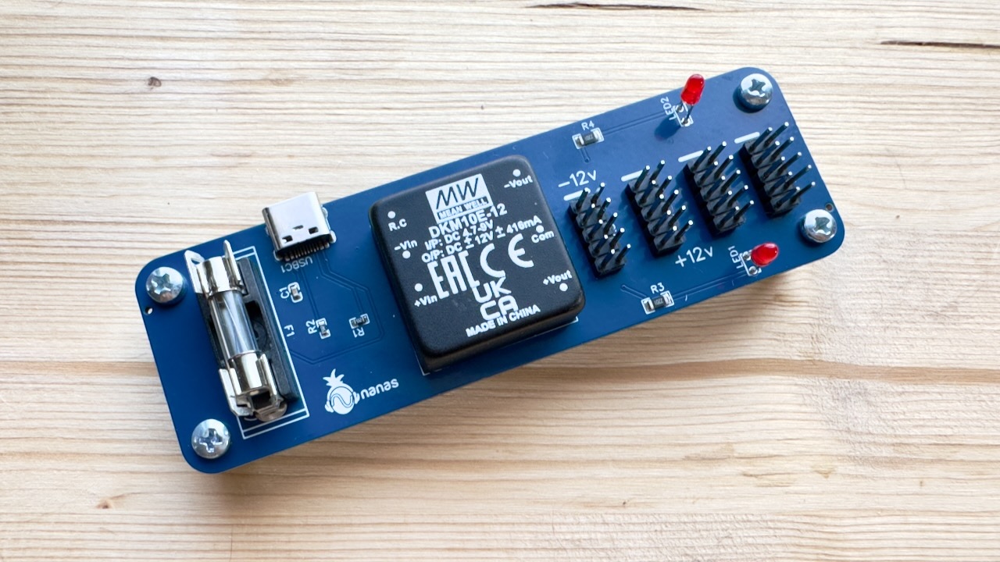

# Mini: USB-C Power Supply

A small and portable USB-C power supply for Eurorack modules.

- It takes 5V input from USB-C port and outputs dual supply +/- 12V.
- The main component that converts the voltage is [Mean Well DKM10E-12](https://www.meanwell-web.com/en-gb/dc-dc-converter-pcb-mount-input-4-7-9vdc-dual-dkm10e--12).
- The output current according to DKM10E-12 datasheet is ±0 ~ 416mA.
- The input voltage range is 4.7V ~ 9V.

## Design decisions

- To allow Mini to use 10 pin power header and keep the design small, it **does not** pass 5V. If the Eurorack module requires 5V, then it's the responsibility of the module to provide it by converting the voltage.
- I add 4A fuse as a safety measure.

## Tested USB-C sources

- MacBook Pro [70W USB-C power adapter](https://www.apple.com/shop/product/MXN53AM/A)
- MacBook Pro M2 USB-C port.
- 40W USB-C phone charger (I don't know the brand)
- Xiaomi 10000mAh USB-A to USB-C power bank

## Tested Eurorack modules

- Nanas Sound Uksed
- Doepfer A-111-6
- Crea8audio Function Junction

## Photos from the test

## Where to buy the PCB?

You can directly contact me via email: [asep@nanassound.com](mailto:asep@nanassound.com).

If I still have some PCBs with pre-assembled SMD components left, I will sell them for 14€. You need to source DKM10E-12, 10 pin unshrouded header, LED, 4A fuse, and fuse holder yourself.

I also can ship the PCBs inside Europe only.

Currently, I'm still setting up my online store.
