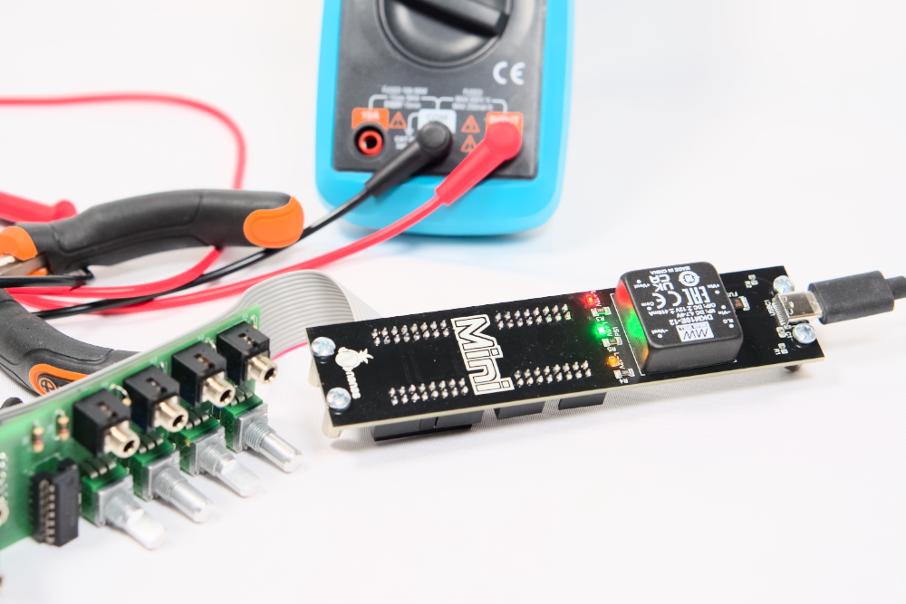
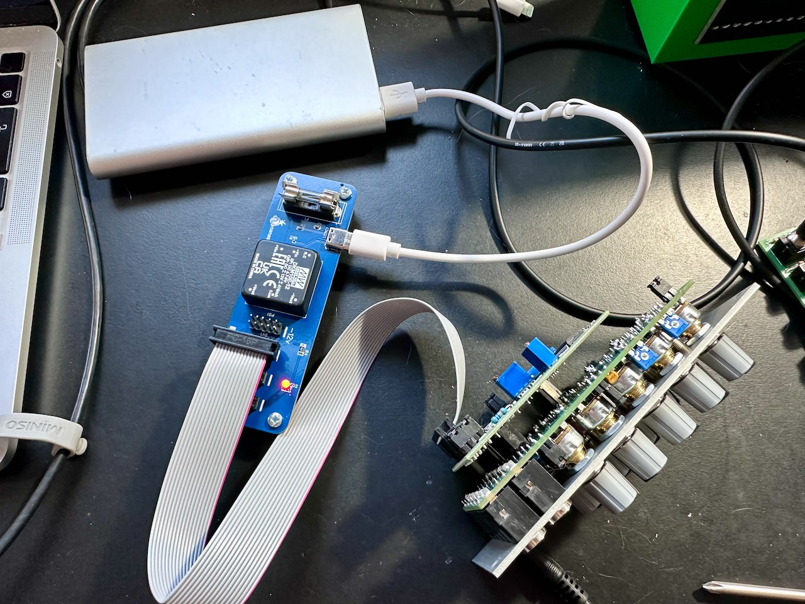
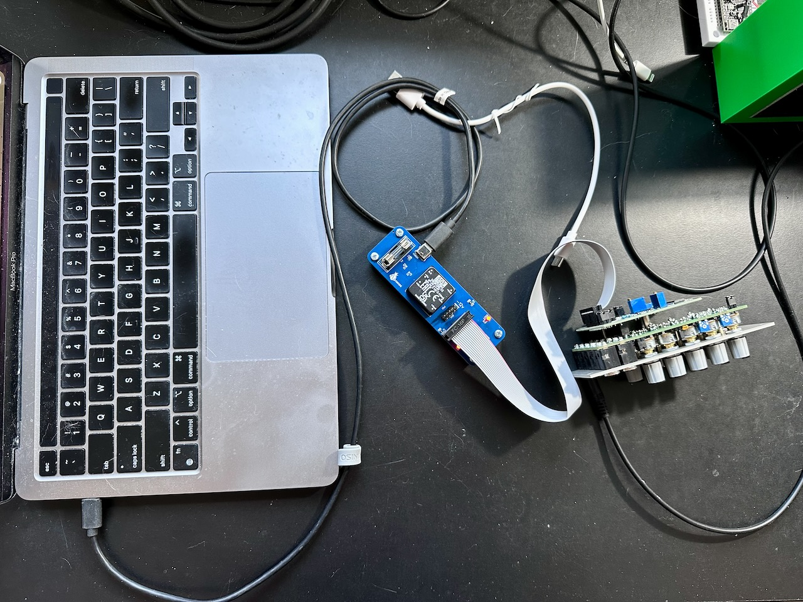

# Mini: USB-C Power Supply

A small and portable USB-C power supply for Eurorack modules.

- It takes 5V input from USB-C port and outputs dual supply +/- 12V and 5V.
- The main component that converts the voltage is [Mean Well DKM10E-12](https://www.meanwell-web.com/en-gb/dc-dc-converter-pcb-mount-input-4-7-9vdc-dual-dkm10e--12).
- The output current according to DKM10E-12 datasheet is ±0 ~ 416mA.
- The input voltage range is 4.7V ~ 9V.

## Design decisions and changes log

#### Version 2.0

- Make the PCB dimension to fit 3U height and 6HP width, so it can be mounted on a 3U rack.
- Replace 10 pin power header with 16 pin power header and pass 5V from USB-C to the module.
- Replace the glass fuse with 4A PPTC (resettable fuse) to protect the circuit from over current.
- Use SMT components as much as possible to make the layout cleaner.

#### Version 1.0

- To allow Mini to use 10 pin power header and keep the design small, it **does not** pass 5V. If the Eurorack module requires 5V, then it's the responsibility of the module to provide it by converting the voltage.
- I add 4A fuse as a safety measure.

## Tested USB-C sources

- MacBook Pro [70W USB-C power adapter](https://www.apple.com/shop/product/MXN53AM/A)
- MacBook Pro M2 USB-C port.
- 40W USB-C phone charger (I don't know the brand)
- Xiaomi 10000mAh USB-A to USB-C power bank

## Tested Eurorack modules

- Nanas Sound Uksed
- Doepfer A-111-6
- Crea8audio Function Junction

## Where to buy Mini?

If you are in Europe, you can buy the fully assembled Mini 2.0 from my store on [Lectronz](https://lectronz.com/products/mini-eurorack-usb-c-power-supply).

For the customer outside of Europe, you can buy it from a shared project on [PCBWay](https://www.pcbway.com/project/shareproject/Mini_Eurorack_modular_synth_USB_C_power_supply_29aeece2.html) or [Elecrow](https://www.elecrow.com/sharepj/mini-eurorack-modular-synth-usb-c-power-supply-988.html).

## Photos from the test of Mini 1.0

