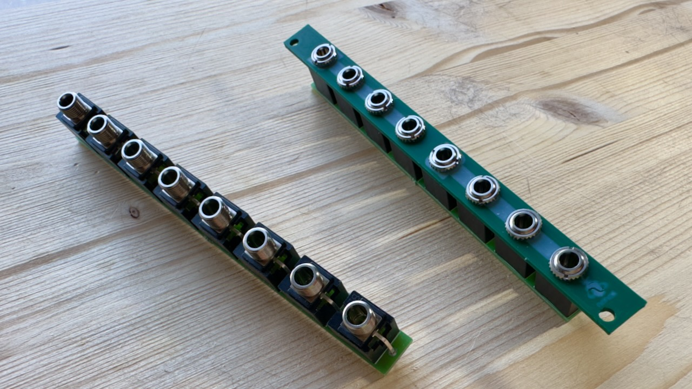

# Rohkem: 1x7 or 2x3 Passive Signal Multiplier

A compact (2HP) and versatile passive signal multiplier module for Eurorack synthesizer.

Rohkem can be configured as a 1x7 or 2x3 passive signal multiplier.

When you don't plug a jack to input number 5, the signal will split into 6 channels.

[x]->[v]->[v]->[v]->[v]->[v]->[v]->[v]

But, if you plug a jack to input number 5, the signal will be configured as 2x3.

[x1]->[v1]->[v1]->[v1]

[x2]->[v2]->[v2]->[v2]
