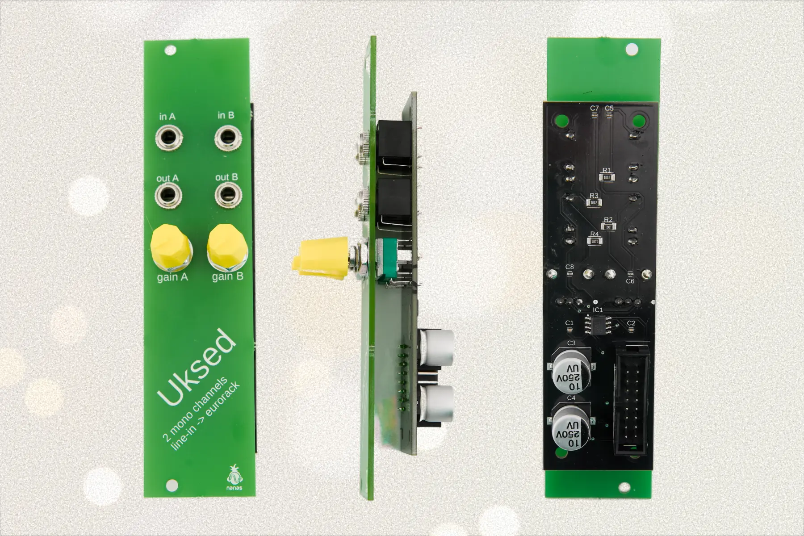

# Uksed - Dual-channel Audio Input Module for Eurorack

Uksed is an open-source dual-channel audio input module that brings line-level signals into your Eurorack system. It amplifies external audio sources to proper Eurorack levels, enabling seamless integration between your modular system and external gear.

## Features

- 2 independent mono input channels
- Converts line-level signals (~3.5Vpp) to Eurorack levels (10Vpp, -5V to +5V)
- Simple circuit design
- 6HP width
- Open-source hardware

## Technical Specifications

- **Input:** Line-level signals (synthesizers, drum machines, samplers, audio interfaces)
- **Output:** Eurorack standard (-5V to +5V)
- **Channels:** 2x mono
- **Depth:** 22mm

## Files

| File | Description |
|------|-------------|
| `Uksed v47_2025-08-21.zip` | Main PCB Gerber files |
| `PCB Panel v3_2025-08-21.zip` | Front panel Gerber files (PCB-based panel) |
| `Uksed_Schematic.pdf` | Circuit schematic |
| `BOM.csv` | Bill of Materials with component specifications |

## Panel Options
- Use the included PCB panel Gerber files for a cost-effective solution
- Alternatively, create your own aluminum or acrylic panel using the dimensions from the panel files

## Compatible Sources

Uksed works great with:
- Desktop synthesizers
- Drum machines and samplers  
- Audio interface outputs
- Mixer sends
- Music players and computers

**Note:** For instruments with passive pickups (guitars/basses), use a DI box or preamp to bring the signal to line level first.

## Support

For questions, issues, or contributions:
- Open an issue in this repository
- Visit [Nanas Sound](https://nanassound.com) for more information

## License

[CC BY-SA 4.0](https://creativecommons.org/licenses/by-sa/4.0/).

## Acknowledgments

Designed and developed by Nanas Sound, Estonia.
