## ESP32-C6-WROOM-1 ESP32-C6-WROOM-1U

## Datasheet Version 1.4

Module that supports 2.4 GHz Wi-Fi 6 (802.11ax), Bluetooth ® 5 (LE), Zigbee and Thread (802.15.4)

Built around ESP32-C6 series of SoCs, 32-bit RISC-V single-core microprocessor

Flash up to 8 MB

23 GPIOs, rich set of peripherals

On-board PCB antenna or external antenna connector

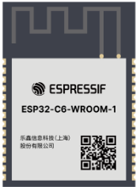

ESP32-C6-WROOM-1

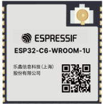

ESP32-C6-WROOM-1U

## 1 Module Overview

## Note:

Check the link or the QR code to make sure that you use the latest version of this document: https://espressif.com/documentation/esp32-c6-wroom-1\_wroom-1u\_datasheet\_en.pdf

## 1.1 Features

## CPU and On-Chip Memory

- ESP32-C6 embedded, 32-bit RISC-V single-core microprocessor, up to 160 MHz
- ROM: 320 KB
- HP SRAM: 512 KB
- LP SRAM: 16 KB

## Wi-Fi

- 1T1R in 2.4 GHz band
- Operating frequency: 2412 ~ 2484 MHz
- IEEE 802.11ax-compliant
- 20 MHz-only non-AP mode
- MCS0 ~ MCS9
- Uplink and downlink OFDMA, especially suitable for simultaneous connections in high-density environments
- Downlink MU-MIMO (multi-user, multiple input, multiple output) to increase network capacity
- Beamformee that improves signal quality
- Channel quality indication (CQI)
- DCM (dual carrier modulation) to improve link robustness
- Spatial reuse to maximize parallel transmissions
- Target wake time (TWT) that optimizes power saving mechanisms
- Fully compatible with IEEE 802.11b/g/n protocol
- 20 MHz and 40 MHz bandwidth
- Data rate up to 150 Mbps
- Wi-Fi Multimedia (WMM)
- TX/RX A-MPDU, TX/RX A-MSDU
- Immediate Block ACK
- Fragmentation and defragmentation
- Transmit opportunity (TXOP)
- Automatic Beacon monitoring (hardware TSF)
- 4 × virtual Wi-Fi interfaces
- Simultaneous support for Infrastructure BSS in Station mode, SoftAP mode, Station + SoftAP mode, and promiscuous mode Note that when ESP32-C6 scans in Station mode, the SoftAP channel will change along with the Station channel
- 802.11mc FTM

## Bluetooth ®

- Bluetooth LE: Bluetooth 5.3 certified
- Bluetooth mesh
- High power mode (20 dBm)
- Speed: 125 Kbps, 500 Kbps, 1 Mbps, 2 Mbps
- Advertising extensions
- Multiple advertisement sets
- Channel selection algorithm #2
- LE power control

- Internal co-existence mechanism between Wi-Fi and Bluetooth to share the same antenna

## IEEE 802.15.4

- Compliant with IEEE 802.15.4-2015 protocol
- OQPSK PHY in 2.4 GHz band
- Data rate: 250 Kbps
- Thread 1.3
- Zigbee 3.0

## Peripherals

- GPIO, SPI, parallel IO interface, UART , I2C, I2S, RMT (TX/RX), pulse counter, LED PWM, USB Serial/JTAG controller, MCPWM, SDIO slave controller, GDMA, TWAI ® controller, on-chip debug functionality via JTAG, event task matrix, ADC, temperature sensor, system timer, general-purpose timers, and watchdog timers

## 1.2 Series Comparison

ESP32-C6-WROOM-1 and ESP32-C6-WROOM-1U are two powerful, general-purpose Wi-Fi, IEEE 802.15.4, and Bluetooth LE modules. The rich set of peripherals and high performance make the module an ideal choice for smart homes, industrial automation, health care, consumer electronics, etc.

ESP32-C6-WROOM-1 comes with a PCB antenna. ESP32-C6-WROOM-1U comes with a connector for an external antenna. They both feature an external SPI flash up to 8 MB.

Both ESP32-C6-WROOM-1 and ESP32-C6-WROOM-1U come in two versions:

- 4 MB flash version
- 8 MB flash version

The two versions only vary in flash part number. In this datasheet unless otherwise stated, ESP32-C6-WROOM-1 and ESP32-C6-WROOM-1U refer to the variants in 4 MB and 8 MB flash versions.

## Integrated Components on Module

- 40 MHz crystal oscillator
- SPI flash

## Antenna Options

- On-board PCB antenna (ESP32-C6-WROOM-1)
- External antenna via a connector (ESP32-C6-WROOM-1U)

## Operating Conditions

- Operating voltage/Power supply: 3.0 ~ 3.6 V
- Operating ambient temperature: -40 ~ 85 °C

## Certification

- RF certification: See certificates
- Green certification: RoHS/REACH

## Test

- HTOL/HTSL/uHAST/TCT/ESD

The series comparison for the two modules is as follows:

Table 1-1. ESP32-C6-WROOM-1 (ANT) Series Comparison 1

| Part Number          | Flash 2,3        | Ambient Temp. 4 (°C)   | Size 5 (mm)       |
|----------------------|------------------|------------------------|-------------------|
| ESP32-C6-WROOM-1-N4  | 4 MB (Quad SPI)  | -40 ∼ 85               | 18.0 × 25.5 × 3.1 |
| ESP32-C6-WROOM-1-N8  | 8 MB (Quad SPI)  | -40 ∼ 85               | 18.0 × 25.5 × 3.1 |
| ESP32-C6-WROOM-1-N16 | 16 MB (Quad SPI) | -40 ∼ 85               | 18.0 × 25.5 × 3.1 |

Table 1-2. ESP32-C6-WROOM-1U (CONN) Series Comparison

| Part Number           | Flash 2,3        | Ambient Temp. 4 (°C)   | Size 5 (mm)       |
|-----------------------|------------------|------------------------|-------------------|
| ESP32-C6-WROOM-1U-N4  | 4 MB (Quad SPI)  | -40 ∼ 85               | 18.0 × 19.2 × 3.2 |
| ESP32-C6-WROOM-1U-N8  | 8 MB (Quad SPI)  | -40 ∼ 85               | 18.0 × 19.2 × 3.2 |
| ESP32-C6-WROOM-1U-N16 | 16 MB (Quad SPI) | -40 ∼ 85               | 18.0 × 19.2 × 3.2 |

At the core of the modules is ESP32-C6, a 32-bit RISC-V single-core processor.

## Note:

For more information on ESP32-C6, please refer to ESP32-C6 Series Datasheet .

Please contact our sales team if you require modules with 4 MB flash and maximum ambient temperature of 105 °C.

## 1.3 Applications

- Smart Home
- Industrial Automation
- Health Care
- Consumer Electronics
- Smart Agriculture
- POS Machines
- Service Robot
- Audio Devices
- Generic Low-power IoT Sensor Hubs
- Generic Low-power IoT Data Loggers

## Contents

|   1 | Module Overview                              |   2 |
|-----|----------------------------------------------|-----|
| 1.1 | Features                                     |   2 |
| 1.2 | Series Comparison                            |   3 |
| 1.3 | Applications                                 |   4 |
|   2 | Block Diagram                                |   9 |
|   3 | Pin Definitions                              |  10 |
| 3.1 | Pin Layout                                   |  10 |
| 3.2 | Pin Description                              |  10 |
|   4 | Boot Configurations                          |  12 |
| 4.1 | Chip Boot Mode Control                       |  13 |
| 4.2 | SDIO Sampling and Driving Clock Edge Control |  14 |
| 4.3 | ROM Messages Printing Control                |  14 |
| 4.4 | JTAG Signal Source Control                   |  15 |
| 4.5 | Chip Power-up and Reset                      |  15 |
|   5 | Peripherals                                  |  17 |
| 5.1 | Functional Overview                          |  17 |
| 5.2 | Peripheral Description                       |  17 |
|     | 5.2.1 Connectivity Interface                 |  17 |
|     | 5.2.1.1 UART Controller                      |  17 |
|     | 5.2.1.2 SPI Controller                       |  18 |
|     | 5.2.1.3 I2C Controller                       |  19 |
|     | 5.2.1.4 I2S Controller                       |  19 |
|     | 5.2.1.5 Pulse Count Controller               |  20 |
|     | 5.2.1.6 USB Serial/JTAG Controller           |  20 |
|     | 5.2.1.7 Two-wire Automotive Interface        |  21 |
|     | 5.2.1.8 SDIO Slave Controller                |  21 |
|     | 5.2.1.9 LED PWM Controller                   |  22 |
|     | 5.2.1.10 Motor Control PWM                   |  22 |
|     | 5.2.1.11 Remote Control Peripheral           |  23 |
|     | 5.2.1.12 Parallel IO Controller              |  24 |
|     | 5.2.2 Analog Signal Processing               |  24 |
|     | 5.2.2.1 SAR ADC                              |  24 |
|     | 5.2.2.2 Temperature Sensor                   |  25 |
|   6 | Electrical Characteristics                   |  26 |
| 6.1 | Absolute Maximum Ratings                     |  26 |
| 6.2 | Recommended Operating Conditions             |  26 |
| 6.3 | DC Characteristics (3.3 V, 25 °C)            |  26 |
| 6.4 | Current Consumption Characteristics          |  27 |

|           | 6.4.1 Current Consumption in Active Mode                |   27 |
|-----------|---------------------------------------------------------|------|
|           | 6.4.2 Current Consumption in Other Modes                |   28 |
| 6.5       | Memory Specifications                                   |   28 |
| 7         | RF Characteristics                                      |   30 |
| 7 .1      | Wi-Fi Radio                                             |   30 |
|           | 7 .1.1 Wi-Fi RF Transmitter (TX) Characteristics        |   30 |
|           | 7 .1.2 Wi-Fi RF Receiver (RX) Characteristics           |   31 |
| 7 .2      | Bluetooth 5 (LE) Radio                                  |   33 |
|           | 7 .2.1 Bluetooth LE RF Transmitter (TX) Characteristics |   33 |
|           | 7 .2.2 Bluetooth LE RF Receiver (RX) Characteristics    |   34 |
| 7 .3      | 802.15.4 Radio                                          |   36 |
|           | 7 .3.1 802.15.4 RF Transmitter (TX) Characteristics     |   37 |
|           | 7 .3.2 802.15.4 RF Receiver (RX) Characteristics        |   37 |
| 8         | Module Schematics                                       |   38 |
| 9         | Peripheral Schematics                                   |   40 |
| 10        | Physical Dimensions                                     |   41 |
| 10.1      | Physical Dimensions                                     |   41 |
| 10.2      | Dimensions of External Antenna Connector                |   42 |
| 11        | PCB Layout Recommendations                              |   44 |
| 11.1      | PCB Land Pattern                                        |   44 |
| 11.2      | Module Placement for PCB Design                         |   45 |
| 12        | Product Handling                                        |   46 |
| 12.1      | Storage Conditions                                      |   46 |
| 12.2      | Electrostatic Discharge (ESD)                           |   46 |
| 12.3      | Reflow Profile                                          |   46 |
| 12.4      | Ultrasonic Vibration                                    |   47 |
| Datasheet | Versioning                                              |   48 |
| Related   | Documentation and Resources                             |   49 |
| Revision  | History                                                 |   50 |

## List of T ables

| 1-1   | ESP32-C6-WROOM-1 (ANT) Series Comparison 1                   |   4 |
|-------|--------------------------------------------------------------|-----|
| 1-2   | ESP32-C6-WROOM-1U (CONN) Series Comparison                   |   4 |
| 3-1   | Pin Definitions                                              |  11 |
| 4-1   | Default Configuration of Strapping Pins                      |  12 |
| 4-2   | Description of Timing Parameters for the Strapping Pins      |  13 |
| 4-3   | Chip Boot Mode Control                                       |  13 |
| 4-4   | SDIO Input Sampling Edge/Output Driving Edge Control         |  14 |
| 4-5   | UART0 ROM Message Printing Control                           |  14 |
| 4-6   | USB Serial/JTAG ROM Message Printing Control                 |  15 |
| 4-7   | JTAG Signal Source Control                                   |  15 |
| 4-8   | Description of Timing Parameters for Power-up and Reset      |  16 |
| 6-1   | Absolute Maximum Ratings                                     |  26 |
| 6-2   | Recommended Operating Conditions                             |  26 |
| 6-3   | DC Characteristics (3.3 V, 25 °C)                            |  26 |
| 6-4   | Current Consumption for Wi-Fi (2.4 GHz) in Active Mode       |  27 |
| 6-5   | Current Consumption for Bluetooth LE in Active Mode          |  27 |
| 6-6   | Current Consumption for 802.15.4 in Active Mode              |  27 |
| 6-7   | Current Consumption in Modem-sleep Mode                      |  28 |
| 6-8   | Current Consumption in Low-Power Modes                       |  28 |
| 6-9   | Flash Specifications                                         |  28 |
| 7-1   | Wi-Fi RF Characteristics                                     |  30 |
| 7-2   | TX Power with Spectral Mask and EVM Meeting 802.11 Standards |  30 |
|       | 7-3 TX EVM Test 1                                            |  30 |
| 7-4   | RX Sensitivity                                               |  31 |
| 7-5   | Maximum RX Level                                             |  32 |
| 7-6   | RX Adjacent Channel Rejection                                |  32 |
| 7-7   | Bluetooth LE RF Characteristics                              |  33 |
| 7-8   | Bluetooth LE - Transmitter Characteristics - 1 Mbps          |  33 |
| 7-9   | Bluetooth LE - Transmitter Characteristics - 2 Mbps          |  33 |
| 7-10  | Bluetooth LE - Transmitter Characteristics - 125 Kbps        |  34 |
| 7-11  | Bluetooth LE - Transmitter Characteristics - 500 Kbps        |  34 |
| 7-12  | Bluetooth LE - Receiver Characteristics - 1 Mbps             |  34 |
| 7-13  | Bluetooth LE - Receiver Characteristics - 2 Mbps             |  35 |
| 7-14  | Bluetooth LE - Receiver Characteristics - 125 Kbps           |  36 |
| 7-15  | Bluetooth LE - Receiver Characteristics - 500 Kbps           |  36 |
| 7-16  | 802.15.4 RF Characteristics                                  |  36 |
| 7-17  | 802.15.4 Transmitter Characteristics - 250 Kbps              |  37 |
| 7-18  | 802.15.4 Receiver Characteristics - 250 Kbps                 |  37 |

## List of Figures

| 2-1   | ESP32-C6-WROOM-1 Block Diagram                            |   9 |
|-------|-----------------------------------------------------------|-----|
| 2-2   | ESP32-C6-WROOM-1U Block Diagram                           |   9 |
| 3-1   | Pin Layout (Top View)                                     |  10 |
| 4-1   | Visualization of Timing Parameters for the Strapping Pins |  13 |
| 4-2   | Visualization of Timing Parameters for Power-up and Reset |  15 |
| 8-1   | ESP32-C6-WROOM-1 Schematics                               |  38 |
| 8-2   | ESP32-C6-WROOM-1U Schematics                              |  39 |
| 9-1   | Peripheral Schematics                                     |  40 |
| 10-1  | ESP32-C6-WROOM-1 Physical Dimensions                      |  41 |
| 10-2  | ESP32-C6-WROOM-1U Physical Dimensions                     |  41 |
| 10-3  | Dimensions of External Antenna Connector                  |  42 |
| 11-1  | ESP32-C6-WROOM-1 Recommended PCB Land Pattern             |  44 |
| 11-2  | ESP32-C6-WROOM-1U Recommended PCB Land Pattern            |  45 |
| 12-1  | Reflow Profile                                            |  46 |

## 2 Block Diagram

Figure 2-1. ESP32-C6-WROOM-1 Block Diagram

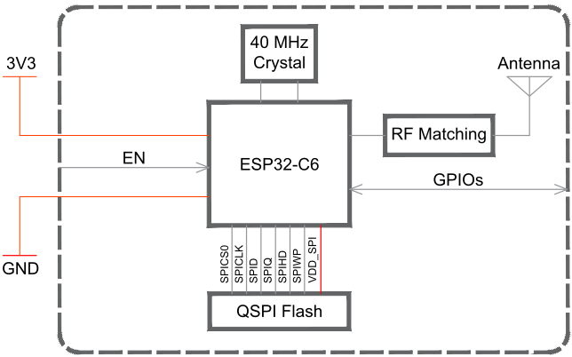

Figure 2-2. ESP32-C6-WROOM-1U Block Diagram

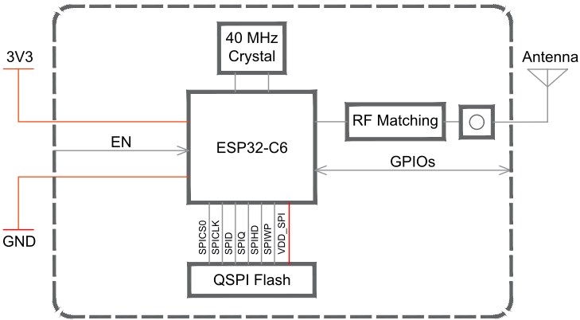

## Note:

For the pin mapping between the chip and the in-package flash, please refer to ESP32-C6 Series Datasheet &gt; T able Pin Mapping Between Chip and Flash .

## 3 Pin Definitions

## 3.1 Pin Layout

The pin diagram below shows the approximate location of pins on the module. For the actual diagram drawn to scale, please refer to Figure 10.1 Physical Dimensions .

The pin diagram is applicable for ESP32-C6-WROOM-1 and ESP32-C6-WROOM-1U, but the latter has no keepout zone.

Figure 3-1. Pin Layout (Top View)

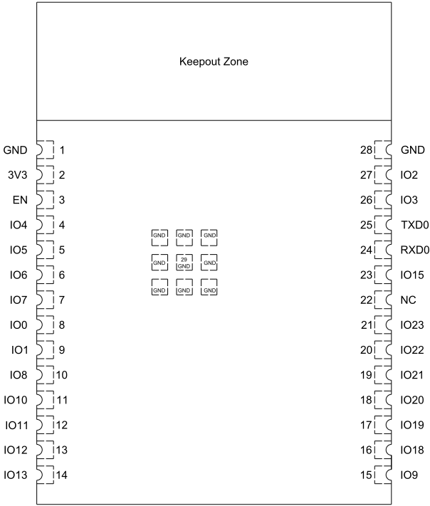

Pin Layout (Top View)

## 3.2 Pin Description

The module has 29 pins. See pin definitions in T able 3-1 Pin Definitions .

Table 3-1. Pin Definitions

| Name   |   No. | Type 1   | Function                                             |
|--------|-------|----------|------------------------------------------------------|
| GND    |     1 | P        | Ground                                               |
| 3V3    |     2 | P        | Power supply                                         |
| EN     |     3 | I        | High: on, enables the chip.                          |
| EN     |     3 | I        | Low: off, the chip powers off.                       |
| EN     |     3 | I        | Note: Do not leave the EN pin floating.              |
| IO4    |     4 | I/O/T    | MTMS, GPIO4, LP_GPIO4, LP_UART_RXD, ADC1_CH4, FSPIHD |
| IO5    |     5 | I/O/T    | MTDI, GPIO5, LP_GPIO5, LP_UART_TXD, ADC1_CH5, FSPIWP |
| IO6    |     6 | I/O/T    | MTCK, GPIO6, LP_GPIO6, LP_I2C_SDA, ADC1_CH6, FSPICLK |
| IO7    |     7 | I/O/T    | MTDO, GPIO7 , LP_GPIO7 , LP_I2C_SCL, FSPID           |
| IO0    |     8 | I/O/T    | GPIO0, XTAL_32K_P, LP_GPIO0, LP_UART_DTRN, ADC1_CH0  |
| IO1    |     9 | I/O/T    | GPIO1, XTAL_32K_N, LP_GPIO1, LP_UART_DSRN, ADC1_CH1  |
| IO8    |    10 | I/O/T    | GPIO8                                                |
| IO10   |    11 | I/O/T    | GPIO10                                               |
| IO11   |    12 | I/O/T    | GPIO11                                               |
| IO12   |    13 | I/O/T    | GPIO12, USB_D-                                       |
| IO13   |    14 | I/O/T    | GPIO13, USB_D+                                       |
| IO9    |    15 | I/O/T    | GPIO9                                                |
| IO18   |    16 | I/O/T    | GPIO18, SDIO_CMD, FSPICS2                            |
| IO19   |    17 | I/O/T    | GPIO19, SDIO_CLK, FSPICS3                            |
| IO20   |    18 | I/O/T    | GPIO20, SDIO_DATA0, FSPICS4                          |
| IO21   |    19 | I/O/T    | GPIO21, SDIO_DATA1, FSPICS5                          |
| IO22   |    20 | I/O/T    | GPIO22, SDIO_DATA2                                   |
| IO23   |    21 | I/O/T    | GPIO23, SDIO_DATA3                                   |
| NC     |    22 | -        | NC                                                   |
| IO15   |    23 | I/O/T    | GPIO15                                               |
| RXD0   |    24 | I/O/T    | U0RXD, GPIO17 , FSPICS1                              |
| TXD0   |    25 | I/O/T    | U0TXD, GPIO16, FSPICS0                               |
| IO3    |    26 | I/O/T    | GPIO3, LP_GPIO3, LP_UART_CTSN, ADC1_CH3              |
| IO2    |    27 | I/O/T    | GPIO2, LP_GPIO2, LP_UART_RTSN, ADC1_CH2, FSPIQ       |
| GND    |    28 | P        | Ground                                               |
| EPAD   |    29 | P        | Ground                                               |

## 4 Boot Configurations

## Note:

The content below is excerpted from ESP32-C6 Series Datasheet &gt; Chapter Boot Configurations . For the strapping pin mapping between the chip and modules, please refer to Chapter 8 Module Schematics .

The chip allows for configuring the following boot parameters through strapping pins and eFuse parameters at power-up or a hardware reset, without microcontroller interaction.

- Chip boot mode
- Strapping pin: GPIO8 and GPIO9
- SDIO Sampling and Driving Clock Edge
- Strapping pin: MTMS and MTDI
- ROM message printing
- Strapping pin: GPIO8
- eFuse parameter: EFUSE\_UART\_PRINT\_CONTROL and EFUSE\_DIS\_USB\_SERIAL\_JTAG\_ROM\_PRINT
- JTAG signal source
- Strapping pin: GPIO15
- eFuse parameter: EFUSE\_DIS\_PAD\_JTAG, EFUSE\_DIS\_USB\_JTAG, and EFUSE\_JTAG\_SEL\_ENABLE

The default values of all the above eFuse parameters are 0, which means that they are not burnt. Given that eFuse is one-time programmable, once programmed to 1, it can never be reverted to 0. For how to program eFuse parameters, please refer to ESP32-C6 Technical Reference Manual &gt; Chapter eFuse Controller .

The default values of the strapping pins, namely the logic levels, are determined by pins' internal weak pull-up/pull-down resistors at reset if the pins are not connected to any circuit, or connected to an external high-impedance circuit.

Table 4-1. Default Configuration of Strapping Pins

| Strapping Pin   | Default Configuration   | Bit Value   |
|-----------------|-------------------------|-------------|
| MTMS            | Floating                | -           |
| MTDI            | Floating                | -           |
| GPIO8           | Floating                | -           |
| GPIO9           | Weak pull-up            | 1           |
| GPIO15          | Floating                | -           |

To change the bit values, the strapping pins should be connected to external pull-down/pull-up resistances. If the ESP32-C6 is used as a device by a host MCU, the strapping pin voltage levels can also be controlled by the host MCU.

All strapping pins have latches. At Chip Reset, the latches sample the bit values of their respective strapping pins and store them until the chip is powered down or shut down. The states of latches cannot be changed in any other way. It makes the strapping pin values available during the entire chip operation, and the pins are freed up to be used as regular IO pins after reset. For details on Chip Reset, see ESP32-C6 Technical Reference Manual &gt; Chapter Reset and Clock .

The timing of signals connected to the strapping pins should adhere to the setup time and hold time specifications in T able 4-2 and Figure 4-1.

Table 4-2. Description of Timing Parameters for the Strapping Pins

| Parameter   | Description                                                                                                                      |   Min (ms) |
|-------------|----------------------------------------------------------------------------------------------------------------------------------|------------|
| t SU        | Setup time is the time reserved for the power rails to stabilize be- fore the CHIP_PU pin is pulled high to activate the chip.   |          0 |
| t H         | Hold time is the time reserved for the chip to read the strapping pin values after CHIP_PU is already high and before these pins |          3 |

start operating as regular IO pins.

Figure 4-1. Visualization of Timing Parameters for the Strapping Pins

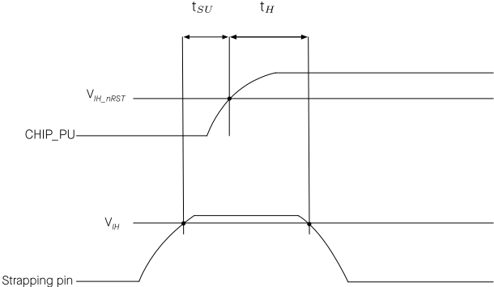

## 4.1 Chip Boot Mode Control

GPIO8 and GPIO9 control the boot mode after the reset is released. See T able 4-3 Chip Boot Mode Control .

Table 4-3. Chip Boot Mode Control

| Boot Mode                  | GPIO8     |   GPIO9 |
|----------------------------|-----------|---------|
| SPI boot mode              | Any value |       1 |
| Joint download boot mode 2 | 1         |       0 |

- USB-Serial-JTAG Download Boot
- SDIO Download Boot
- UART Download Boot

## 4.2 SDIO Sampling and Driving Clock Edge Control

The strapping pin MTMS and MTDI can be used to decide on which clock edge to sample signals and drive output lines. See T able 4-4 SDIO Input Sampling Edge/Output Driving Edge Control .

Table 4-4. SDIO Input Sampling Edge/Output Driving Edge Control

| Edge behavior                              |   MTMS |   MTDI |
|--------------------------------------------|--------|--------|
| Falling edge sampling, falling edge output |      0 |      0 |
| Falling edge sampling, rising edge output  |      0 |      1 |
| Rising edge sampling, falling edge output  |      1 |      0 |
| Rising edge sampling, rising edge output   |      1 |      1 |

## 4.3 ROM Messages Printing Control

During the boot process, ROM message printing is enabled if LP\_AON\_STORE4\_REG[0] is 0 (default), and disabled if LP\_AON\_STORE4\_REG[0] is 1. When ROM message printing is enabled, the messages can be printed to:

- (Default) UART0 and USB Serial/JTAG controller
- USB Serial/JTAG controller
- UART0

EFUSE\_UART\_PRINT\_CONTROL and GPIO8 control ROM messages printing to UART0 as shown in T able 4-5 UART0 ROM Message Printing Control .

Table 4-5. UART0 ROM Message Printing Control

| UART0 ROM Code Printing   |   EFUSE_UART_PRINT_CONTROL | GPIO8   |
|---------------------------|----------------------------|---------|
| Enabled                   |                          0 | Ignored |
| Enabled                   |                          1 | 0       |
| Enabled                   |                          2 | 1       |
| Disabled                  |                          1 | 1       |
| Disabled                  |                          2 | 0       |
| Disabled                  |                          3 | Ignored |

EFUSE\_DIS\_USB\_SERIAL\_JTAG\_ROM\_PRINT controls the printing to USB Serial/JTAG controller as shown in Table 4-6 USB Serial/JTAG ROM Message Printing Control .

Table 4-6. USB Serial/JTAG ROM Message Printing Control

| USB Serial/JTAG ROM Code Printing   |   EFUSE_DIS_USB_SERIAL_JTAG 2 | EFUSE_DIS_USB_SERIAL_JTAG_ROM_PRINT   |
|-------------------------------------|-------------------------------|---------------------------------------|
| Enabled                             |                             0 | 0                                     |
| Disabled                            |                             0 | 1                                     |
| Disabled                            |                             1 | Ignored                               |

## 4.4 JTAG Signal Source Control

The strapping pin GPIO15 can be used to control the source of JTAG signals during the early boot process. This pin does not have any internal pull resistors and the strapping value must be controlled by the external circuit that cannot be in a high impedance state.

As T able 4-7 JTAG Signal Source Control shows, GPIO15 is used in combination with EFUSE\_DIS\_PAD\_JTAG, EFUSE\_DIS\_USB\_JTAG and EFUSE\_JTAG\_SEL\_ENABLE.

Table 4-7 . JTAG Signal Source Control

| JTAG Signal Source         |   EFUSE_DIS_PAD_JTAG |   EFUSE_DIS_USB_JTAG | EFUSE_JTAG_SEL_ENABLE   | GPIO15   |
|----------------------------|----------------------|----------------------|-------------------------|----------|
| USB Serial/JTAG Controller |                    0 |                    0 | 0                       | Ignored  |
| USB Serial/JTAG Controller |                    0 |                    0 | 1                       | 1        |
| USB Serial/JTAG Controller |                    1 |                    0 | Ignored                 | Ignored  |
| JTAG pins 2                |                    0 |                    0 | 1                       | 0        |
| JTAG pins 2                |                    0 |                    1 | Ignored                 | Ignored  |
| JTAG is disabled           |                    1 |                    1 | Ignored                 | Ignored  |

## 4.5 Chip Power-up and Reset

Once the power is supplied to the chip, its power rails need a short time to stabilize. After that, CHIP\_PU - the pin used for power-up and reset - is pulled high to activate the chip. For information on CHIP\_PU as well as power-up and reset timing, see Figure 4-2 and T able 4-8.

Figure 4-2. Visualization of Timing Parameters for Power-up and Reset

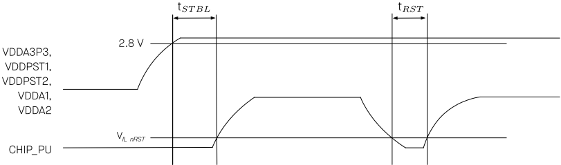

Table 4-8. Description of Timing Parameters for Power-up and Reset

| Parameter   | Description                                                                                                                                               |   Min ( µ s) |
|-------------|-----------------------------------------------------------------------------------------------------------------------------------------------------------|--------------|
| t STBL      | Time reserved for the power rails of VDDA3P3, VDDPST1, VD- DPST2, VDDA1 and VDDA2 to stabilize before the CHIP_PU pin is pulled high to activate the chip |           50 |
| t RST       | Time reserved for CHIP_PU to stay below V IL _ nRST to reset the chip (see Table 6-3)                                                                     |           50 |

## 5 Peripherals

## 5.1 Functional Overview

ESP32-C6 integrates a rich set of peripherals including SPI, parallel IO interface, UART , I2C, I2S, RMT (TX/RX), LED PWM, USB Serial/JTAG controller, MCPWM, SDIO slave controller, GDMA, TWAI ® controller, on-chip debug functionality via JTAG, event task matrix, ADC, as well as up to 23 GPIOs, etc.

For detailed information about module peripherals, please refer to ESP32-C6 Series Datasheet &gt; Section Functional Description . Note that the ADC measurement range and accuracy in the ESP32-C6 Series Datasheet are applicable to modules manufactured on and after the PW Number PW-2023-07-XXX on packaging labels. For modules manufactured earlier than these PW numbers, please ask our sales team to provide the actual range and accuracy according to batches.

## Note:

The content below is excerpted from ESP32-C6 Series Datasheet &gt; Section Peripherals . Some information may not be applicable to ESP32-C6-WROOM-1 and ESP32-C6-WROOM-1U as not all the IO signals are exposed on the module. To learn more details about peripherals signals, please refer to ESP32-C6 Technical Reference Manual &gt; Section Peripheral Signal List .

## 5.2 Peripheral Description

This section describes the chip's peripheral capabilities, covering connectivity interfaces and on-chip sensors that extend its functionality.

## 5.2.1 Connectivity Interface

This subsection describes the connectivity interfaces on the chip that enable communication and interaction with external devices and networks.

## 5.2.1.1 UART Controller

The UART Controller in the ESP32-C6 chip facilitates the transmission and reception of asynchronous serial data between the chip and external UART devices. It consists of two UARTs in the main system, and one low-power LP UART.

## Feature List

- Programmable baud rates up to 5 MBaud
- RAM shared by TX FIFOs and RX FIFOs
- Support for various lengths of data bits and stop bits
- Parity bit support
- Special character AT \_CMD detection
- RS485 protocol support (not supported by LP UART)
- IrDA protocol support (not supported by LP UART)

- High-speed data communication using GDMA (not supported by LP UART)
- Receive timeout feature
- UART as the wake-up source
- Software and hardware flow control

## Pin Assignment

For details, see ESP32-C6 Series Datasheet &gt; Section Peripheral Pin Assignment .

## 5.2.1.2 SPI Controller

ESP32-C6 has the following SPI interfaces:

- SPI0 used by ESP32-C6's cache and GDMA to access in-package or off-package flash
- SPI1 used by the CPU to access in-package or off-package flash
- SPI2 is a general-purpose SPI controller with access to general-purpose DMA channels

SPI0 and SPI1 are reserved for system use, and only SPI2 is available for users.

## Features of SPI0 and SPI1

- Supports Single SPI, Dual SPI, Quad SPI (QPI) modes
- Data transmission is in bytes

## Features of SPI2

- Supports operation as a master or slave
- Support for GDMA
- Supports Single SPI, Dual SPI, Quad SPI (QPI) modes
- Configurable clock polarity (CPOL) and phase (CPHA)
- Configurable clock frequency
- Data transmission is in bytes
- Configurable read and write data bit order: most-significant bit (MSB) first, or least-significant bit (LSB) first
- As a master
- Supports 2-line full-duplex communication with clock frequency up to 80 MHz
- Supports 1-, 2-, 4-line half-duplex communication with clock frequency up to 80 MHz
- Provides six FSPICS… pins for connection with six independent SPI slaves
- Configurable CS setup time and hold time
- As a slave
- Supports 2-line full-duplex communication with clock frequency up to 40 MHz

- Supports 1-, 2-, 4-line half-duplex communication with clock frequency up to 40 MHz

## Pin Assignment

For details, see ESP32-C6 Series Datasheet &gt; Section Peripheral Pin Assignment .

## 5.2.1.3 I2C Controller

The I2C Controller supports communication between the master and slave devices using the I2C bus.

## Feature List

- Two I2C controllers: one in the main system and one in the low-power system
- Communication with multiple external devices
- Master and slave modes for I2C, and master mode only for LP I2C
- Standard mode (100 Kbit/s) and fast mode (400 Kbit/s)
- SCL clock stretching in slave mode
- Programmable digital noise filtering
- Support for 7-bit and 10-bit addressing, as well as dual address mode

## Pin Assignment

For details, see ESP32-C6 Series Datasheet &gt; Section Peripheral Pin Assignment .

## 5.2.1.4 I2S Controller

The I2S Controller in the ESP32-C6 chip provides a flexible communication interface for streaming digital data in multimedia applications, particularly digital audio applications.

## Feature List

- Master mode and slave mode
- Full-duplex and half-duplex communications
- Separate TX and RX units that can work independently or simultaneously
- A variety of audio standards supported:
- TDM Philips standard
- TDM MSB alignment standard
- TDM PCM standard
- PDM standard
- PCM-to-PDM TX interface
- Configurable high-precision BCK clock, with frequency up to 40 MHz

- Sampling frequencies can be 8 kHz, 16 kHz, 32 kHz, 44.1 kHz, 48 kHz, 88.2 kHz, 96 kHz, 128 kHz, 192 kHz, etc.
- 8-/16-/24-/32-bit data communication
- Direct Memory Access (DMA)
- A-law and µ -law compression/decompression algorithms for improved signal-to-quantization noise ratio
- Flexible data format control

## Pin Assignment

For details, see ESP32-C6 Series Datasheet &gt; Section Peripheral Pin Assignment .

## 5.2.1.5 Pulse Count Controller

The Pulse Count Controller (PCNT) is designed to count input pulses by tracking rising and falling edges of the input pulse signal.

## Feature List

- Four independent pulse counters with two channels each
- Counter modes: increment, decrement, or disable
- Glitch filtering for input pulse signals and control signals
- Selection between counting on rising or falling edges of the input pulse signal

## Pin Assignment

For details, see ESP32-C6 Series Datasheet &gt; Section Peripheral Pin Assignment .

## 5.2.1.6 USB Serial/JTAG Controller

The USB Serial/JTAG controller in the ESP32-C6 chip provides an integrated solution for communicating to the chip over a standard USB CDC-ACM serial port as well as a convenient method for JTAG debugging. It eliminates the need for external chips or JTAG adapters, saving space and reducing cost.

## Feature List

- USB 2.0 full speed compliant, capable of up to 12 Mbit/s transfer speed (Note that this controller does not support the faster 480 Mbit/s high-speed transfer mode)
- CDC-ACM virtual serial port and JTAG adapter functionality
- CDC-ACM:
- CDC-ACM adherent serial port emulation (plug-and-play on most modern OSes)
- Host controllable chip reset and entry into download mode
- JTAG adapter functionality:
- Fast communication with CPU debugging core using a compact representation of JTAG instructions

- Support for reprogramming of attached flash memory through the ROM startup code
- Internal PHY

## Pin Assignment

For details, see ESP32-C6 Series Datasheet &gt; Section Peripheral Pin Assignment .

## 5.2.1.7 Two-wire Automotive Interface

The Two-wire Automotive Interface (TWAI ® ) is a multi-master, multi-cast communication protocol designed for automotive applications. The TWAI controller facilitates the communication based on this protocol.

## Feature List

- Compatible with ISO 11898-1 protocol (CAN Specification 2.0)
- Standard frame format (11-bit ID) and extended frame format (29-bit ID)
- Bit rates from 1 Kbit/s to 1 Mbit/s
- Multiple modes of operation: Normal, Listen Only, and Self-Test (no acknowledgment required)
- Special transmissions: Single-shot and Self Reception
- Acceptance filter (single and dual filter modes)
- Error detection and handling: error counters, configurable error warning limit, error code capture, arbitration lost capture, automatic transceiver standby

## Pin Assignment

For details, see ESP32-C6 Series Datasheet &gt; Section Peripheral Pin Assignment .

## 5.2.1.8 SDIO Slave Controller

The SDIO Slave Controller in the ESP32-C6 chip provides hardware support for the Secure Digital Input/Output (SDIO) device interface. It allows an SDIO host to access the ESP32-C6 via an SDIO bus protocol.

## Feature List

- Compatible with SD Physical Layer Specification V2.00 and SDIO V2.00 specifications
- Support for SPI, 1-bit SDIO, and 4-bit SDIO transfer modes
- Clock range of 0 ~ 50 MHz
- Configurable sample and drive clock edge
- Integrated and SDIO-accessible registers for information interaction
- Support for SDIO interrupt mechanism
- Automatic padding data and discarding the padded data on the SDIO bus
- Block size up to 512 bytes
- Interrupt vector between the host and slave for bidirectional interrupt

- Support DMA for data transfer
- Support for wake-up from sleep when connection is retained

## Pin Assignment

For details, see ESP32-C6 Series Datasheet &gt; Section Peripheral Pin Assignment .

## 5.2.1.9 LED PWM Controller

The LED PWM Controller (LEDC) is designed to generate PWM signals for LED control.

## Feature List

- Six independent PWM generators
- Maximum PWM duty cycle resolution of 20 bits
- Four independent timers with 20-bit counters, configurable fractional clock dividers and counter overflow values
- Adjustable phase of PWM signal output
- PWM duty cycle dithering
- Automatic duty cycle fading
- Linear duty cycle fading - only one duty cycle range
- Gamma curve fading - up to 16 duty cycle ranges for each PWM generator, with independently configured fading direction (increase or decrease), fading amount, number of fades, and fading frequency
- PWM signal output in low-power mode (Light-sleep mode)
- Event generation and task response achieved by the Event T ask Matrix (ETM)

## Pin Assignment

For details, see ESP32-C6 Series Datasheet &gt; Section Peripheral Pin Assignment .

## 5.2.1.10 Motor Control PWM

The Motor Control Pulse Width Modulator (MCPWM) is designed for driving digital motors and smart light. The MCPWM is divided into five main modules: PWM timers, PWM operators, Capture module, Fault Detection module, and Event T ask Matrix (ETM) module.

## Feature List

- Three PWM timers for precise timing and frequency control
- Every PWM timer has a dedicated 8-bit clock prescaler
- The 16-bit counter in the PWM timer can work in count-up mode, count-down mode, or count-up-down mode

- Hardware or software synchronization to trigger a reload on the PWM timer or the prescaler's restart, with selectable hardware synchronization source
- Three PWM operators for generating waveform pairs
- Six PWM outputs to operate in several topologies
- Configurable dead time on rising and falling edges; each set up independently
- Modulating of PWM output by high-frequency carrier signals, useful when gate drivers are insulated with a transformer
- Capture module for hardware-based signal processing
- Speed measurement of rotating machinery
- Measurement of elapsed time between position sensor pulses
- Period and duty cycle measurement of pulse train signals
- Decoding current or voltage amplitude derived from duty-cycle-encoded signals of current/voltage sensors
- Three individual capture channels, each of which with a 32-bit time-stamp register
- Selection of edge polarity and prescaling of input capture signals
- The capture timer can sync with a PWM timer or external signals
- Fault Detection module
- Programmable fault handling in both cycle-by-cycle mode and one-shot mode
- A fault condition can force the PWM output to either high or low logic levels
- Event generation and task response achieved by the Event T ask Matrix (ETM)

## Pin Assignment

For details, see ESP32-C6 Series Datasheet &gt; Section Peripheral Pin Assignment .

## 5.2.1.11 Remote Control Peripheral

The Remote Control Peripheral (RMT) controls the transmission and reception of infrared remote control signals.

## Feature List

- Four channels for sending and receiving infrared remote control signals
- Independent transmission and reception capabilities for each channel
- Support for Normal TX/RX mode, Wrap TX/RX mode, Continuous TX mode
- Modulation on TX pulses and Demodulation on RX pulses
- RX filtering for improved signal reception
- Ability to transmit data simultaneously on multiple channels
- Clock divider counter, state machine, and receiver for each RX channel

- Default allocation of RAM blocks to channels based on channel number
- RAM containing 16-bit entries with 'level' and 'period' fields

## Pin Assignment

For details, see ESP32-C6 Series Datasheet &gt; Section Peripheral Pin Assignment .

## 5.2.1.12 Parallel IO Controller

The Parallel IO Controller (PARLIO) in the ESP32-C6 chip enables data transfer between external devices and internal memory on a parallel bus through GDMA. It consists of a transmitter (TX unit) and a receiver (RX unit), making it a versatile interface for connecting various peripherals.

## Feature List

- 1/2/4/8/16-bit configurable data bus width
- Half-duplex communication with 16-bit data bus width and full-duplex communication with 8-bit data bus width
- Bit reordering in 1/2/4-bit data bus width mode
- RX unit supports 15 receive modes categorized into three major categories: Level Enable mode, Pulse Enable mode, and Software Enable mode
- TX unit can generate a valid signal aligned with TX

## Pin Assignment

For details, see ESP32-C6 Series Datasheet &gt; Section Peripheral Pin Assignment .

## 5.2.2 Analog Signal Processing

This subsection describes components on the chip that sense and process real-world data.

## 5.2.2.1 SAR ADC

ESP32-C6 integrates a Successive Approximation Analog-to-Digital Converter (SAR ADC) to convert analog signals into digital representations.

## Feature List

- 12-bit sampling resolution
- Analog voltage sampling from up to seven pins
- Attenuation of input signals for voltage conversion
- Software-triggered one-time sampling
- Timer-triggered multi-channel scanning
- DMA continuous conversion for seamless data transfer
- Two filters with configurable filter coefficient

- Threshold monitoring which helps to trigger an interrupt
- Support for Event T ask Matrix

## Pin Assignment

For details, see ESP32-C6 Series Datasheet &gt; Section Peripheral Pin Assignment .

## 5.2.2.2 Temperature Sensor

The Temperature Sensor in the ESP32-C6 chip allows for real-time monitoring of temperature changes inside the chip.

## Feature List

- Measurement range: -40°C ~ 125°C
- Software triggering, wherein the data can be read continuously once triggered
- Hardware automatic triggering and temperature monitoring
- Configurable temperature offset based on the environment to improve the accuracy
- Adjustable measurement range
- Two automatic monitoring wake-up modes: absolute value mode and incremental value mode
- Support for Event T ask Matrix

## 6 Electrical Characteristics

## 6.1 Absolute Maximum Ratings

Stresses above those listed in T able 6-1 Absolute Maximum Ratings may cause permanent damage to the device. These are stress ratings only and functional operation of the device at these or any other conditions beyond those indicated under T able 6-2 Recommended Operating Conditions is not implied. Exposure to absolute-maximum-rated conditions for extended periods may affect device reliability.

Table 6-1. Absolute Maximum Ratings

| Symbol   | Parameter            |   Min |   Max | Unit   |
|----------|----------------------|-------|-------|--------|
| VDD33    | Power supply voltage |  -0.3 |   3.6 | V      |
| T STORE  | Storage temperature  |   -40 |   105 | °C     |

## 6.2 Recommended Operating Conditions

Table 6-2. Recommended Operating Conditions

| Symbol   | Parameter                           |                |   Min | Typ   | Max   | Unit   |
|----------|-------------------------------------|----------------|-------|-------|-------|--------|
| VDD33    | Power supply voltage                |                |   3.0 | 3.3   | 3.6   | V      |
| I VDD    | Current delivered by external power | supply         |   0.5 | -     | -     | A      |
| T A      | Operating ambient temperature       | 85 °C version  |   -40 | -     | 85    | °C     |
| T A      |                                     | 105 °C version |   -40 | -     | 105   | °C     |

## 6.3 DC Characteristics (3.3 V, 25 °C)

Table 6-3. DC Characteristics (3.3 V, 25 °C)

| Parameter   | Description                                                                | Min          | Typ   | Max          | Unit   |
|-------------|----------------------------------------------------------------------------|--------------|-------|--------------|--------|
| C IN        | Pin capacitance                                                            | -            | 2     | -            | pF     |
| V IH        | High-level input voltage                                                   | 0.75 × VDD 1 | -     | VDD 1 + 0.3  | V      |
| V IL        | Low-level input voltage                                                    | -0.3         | -     | 0.25 × VDD 1 | V      |
| I IH        | High-level input current                                                   | -            | -     | 50           | nA     |
| I IL        | Low-level input current                                                    | -            | -     | 50           | nA     |
| V OH 2      | High-level output voltage                                                  | 0.8 × VDD 1  | -     | -            | V      |
| V OL 2      | Low-level output voltage                                                   | -            | -     | 0.1 × VDD 1  | V      |
| I OH        | High-level source current (VDD 1 = 3.3 V, V OH >= 2.64 V, PAD_DRIVER = 3)  | -            | 40    | -            | mA     |
| I OL        | Low-level sink current (VDD 1 = 3.3 V, V OL = 0.495 V, PAD_DRIVER = 3)     | -            | 28    | -            | mA     |
| R PU        | Internal weak pull-up resistor                                             | -            | 45    | -            | k Ω    |
| R PD        | Internal weak pull-down resistor                                           | -            | 45    | -            | k Ω    |
| V IH _ nRST | Chip reset release voltage (CHIP_PU voltage is within the specified range) | 0.75 × VDD 1 | -     | VDD 1 + 0.3  | V      |

| V IL _ nRST   | Chip reset voltage (CHIP_PU voltage is within the specified range)   | -0.3   | -   | 0.25 × VDD 1   | V   |
|---------------|----------------------------------------------------------------------|--------|-----|----------------|-----|

## 6.4 Current Consumption Characteristics

## 6.4.1 Current Consumption in Active Mode

The current consumption measurements are taken with a 3.3 V supply at 25 °C ambient temperature.

TX current consumption is rated at a 100% duty cycle.

RX current consumption is rated when the peripherals are disabled and the CPU idle.

Table 6-4. Current Consumption for Wi-Fi (2.4 GHz) in Active Mode

| Work Mode           | RF Condition   | Description                       |   Peak (mA) |
|---------------------|----------------|-----------------------------------|-------------|
| Active (RF working) | TX             | 802.11b, 1 Mbps, DSSS @ 20.5 dBm  |         382 |
| Active (RF working) | TX             | 802.11g, 54 Mbps, OFDM @ 19.0 dBm |         316 |
| Active (RF working) | TX             | 802.11n, HT20, MCS7 @ 18.0 dBm    |         295 |
| Active (RF working) | TX             | 802.11n, HT40, MCS7 @ 17 .5 dBm   |         280 |
| Active (RF working) | TX             | 802.11ax, MCS9 @ 15.5 dBm         |         251 |
| Active (RF working) | RX             | 802.11b/g/n, HT20                 |          78 |
| Active (RF working) | RX             | 802.11n, HT40                     |          82 |
| Active (RF working) | RX             | 802.11ax, HE20                    |          78 |

Table 6-5. Current Consumption for Bluetooth LE in Active Mode

| Work Mode           | RF Condition   | Description              |   Peak (mA) |
|---------------------|----------------|--------------------------|-------------|
| Active (RF working) | TX             | Bluetooth LE @ 19.0 dBm  |         309 |
| Active (RF working) | TX             | Bluetooth LE @ 9.0 dBm   |         190 |
| Active (RF working) | TX             | Bluetooth LE @ 0 dBm     |         130 |
| Active (RF working) | TX             | Bluetooth LE @ -16.0 dBm |          93 |
| Active (RF working) | RX             | Bluetooth LE             |          73 |

Table 6-6. Current Consumption for 802.15.4 in Active Mode

| Work Mode           | RF Condition   | Description          |   Peak (mA) |
|---------------------|----------------|----------------------|-------------|
| Active (RF working) | TX             | 802.15.4 @ 19.0 dBm  |         302 |
| Active (RF working) | TX             | 802.15.4 @ 12.0 dBm  |         185 |
| Active (RF working) | TX             | 802.15.4 @ 0 dBm     |         117 |
| Active (RF working) | TX             | 802.15.4 @ -16.0 dBm |          91 |
| Active (RF working) | RX             | 802.15.4             |          73 |

## Note:

The content below is excerpted from Section Current Consumption in Other Modes in ESP32-C6 Series Datasheet .

## 6.4.2 Current Consumption in Other Modes

Table 6-7 . Current Consumption in Modem-sleep Mode

| Mode           | CPU Frequency (MHz)   | Description    | Typ (mA)                        | Typ (mA)                         |
|----------------|-----------------------|----------------|---------------------------------|----------------------------------|
| Mode           | CPU Frequency (MHz)   | Description    | All Peripherals Clocks Disabled | All Peripherals Clocks Enabled 1 |
| Modem-sleep 2, | 3 160                 | CPU is running | 27                              | 38                               |
| Modem-sleep 2, | 3 160                 | CPU is idle    | 17                              | 28                               |
| Modem-sleep 2, | 80                    | CPU is running | 19                              | 30                               |
| Modem-sleep 2, | 80                    | CPU is idle    | 14                              | 25                               |

Table 6-8. Current Consumption in Low-Power Modes

| Mode        | Description                                                                                                               |   Typ ( µ A) |
|-------------|---------------------------------------------------------------------------------------------------------------------------|--------------|
| Light-sleep | CPU and wireless communication modules are powered down, peripheral clocks are disabled, and all GPIOs are high-impedance |          180 |
| Light-sleep | CPU, wireless communication modules and peripherals are pow- ered down, and all GPIOs are high-impedance                  |           35 |
| Deep-sleep  | RTC timer and LP memory are powered on                                                                                    |            7 |
| Power off   | CHIP_PU is set to low level, the chip is powered off                                                                      |            1 |

## 6.5 Memory Specifications

The data below is sourced from the memory vendor datasheet. These values are guaranteed through design and/or characterization but are not fully tested in production. Devices are shipped with the memory erased.

Table 6-9. Flash Specifications

| Parameter   | Description                  | Min     | Typ   | Max   | Unit   |
|-------------|------------------------------|---------|-------|-------|--------|
| VCC         | Power supply voltage (1.8 V) | 1.65    | 1.80  | 2.00  | V      |
| VCC         | Power supply voltage (3.3 V) | 2.7     | 3.3   | 3.6   | V      |
| F C         | Maximum clock frequency      | 80      | -     | -     | MHz    |
| -           | Program/erase cycles         | 100,000 | -     | -     | cycles |
| T RET       | Data retention time          | 20      | -     | -     | years  |
| T PP        | Page program time            | -       | 0.8   | 5     | ms     |

Cont'd on next page

Table 6-9 - cont'd from previous page

| Parameter   | Description              | Min   |   Typ |   Max | Unit   |
|-------------|--------------------------|-------|-------|-------|--------|
| T SE        | Sector erase time (4 KB) | -     |    70 |   500 | ms     |
| T BE 1      | Block erase time (32 KB) | -     |   0.2 |     2 | s      |
| T BE 2      | Block erase time (64 KB) | -     |   0.3 |     3 | s      |
| T CE        | Chip erase time (16 Mb)  | -     |     7 |    20 | s      |
| T CE        | Chip erase time (32 Mb)  | -     |    20 |    60 | s      |
| T CE        | Chip erase time (64 Mb)  | -     |    25 |   100 | s      |
| T CE        | Chip erase time (128 Mb) | -     |    60 |   200 | s      |
| T CE        | Chip erase time (256 Mb) | -     |    70 |   300 | s      |

## 7 RF Characteristics

This section contains tables with RF characteristics of the Espressif product.

The RF data is measured at the antenna port, where RF cable is connected, including the front-end loss. The external antennas used for the tests on the modules with external antenna connectors have an impedance of 50 Ω .

Devices should operate in the center frequency range allocated by regional regulatory authorities. The target center frequency range and the target transmit power are configurable by software. See ESP RF Test Tool and Test Guide for instructions.

Unless otherwise stated, the RF tests are conducted with a 3.3 V (±5%) supply at 25 ºC ambient temperature.

## 7 . 1 Wi-Fi Radio

Table 7-1. Wi-Fi RF Characteristics

| Name                                        | Description         |
|---------------------------------------------|---------------------|
| Center frequency range of operating channel | 2412 ~ 2484 MHz     |
| Wi-Fi wireless standard                     | IEEE 802.11b/g/n/ax |

## 7 . 1. 1 Wi-Fi RF Transmitter (TX) Characteristics

Table 7-2. TX Power with Spectral Mask and EVM Meeting 802.11 Standards

|                        | Min   | Typ   | Max   |
|------------------------|-------|-------|-------|
| Rate                   | (dBm) | (dBm) | (dBm) |
| 802.11b, 1 Mbps, DSSS  | -     | 20.5  | -     |
| 802.11b, 11 Mbps, CCK  | -     | 20.5  | -     |
| 802.11g, 6 Mbps, OFDM  | -     | 20.0  | -     |
| 802.11g, 54 Mbps, OFDM | -     | 19.0  | -     |
| 802.11n, HT20, MCS0    | -     | 19.0  | -     |
| 802.11n, HT20, MCS7    | -     | 18.0  | -     |
| 802.11n, HT40, MCS0    | -     | 18.5  | -     |
| 802.11n, HT40, MCS7    | -     | 17 .5 | -     |
| 802.11ax, HE20, MCS0   | -     | 19.0  | -     |
| 802.11ax, HE20, MCS9   | -     | 15.5  | -     |

Table 7-3. TX EVM Test 1

|                       | Min   | Typ   | Limit   |
|-----------------------|-------|-------|---------|
| Rate                  | (dB)  | (dB)  | (dB)    |
| 802.11b, 1 Mbps, DSSS | -     | -25.0 | -10.0   |
| 802.11b, 11 Mbps, CCK | -     | -25.0 | -10.0   |

Cont'd on next page

Table 7-3 - cont'd from previous page

|                        | Min   | Typ    | Limit   |
|------------------------|-------|--------|---------|
| Rate                   | (dB)  | (dB)   | (dB)    |
| 802.11g, 6 Mbps, OFDM  | -     | -24.0  | -5.0    |
| 802.11g, 54 Mbps, OFDM | -     | -28.0  | -25.0   |
| 802.11n, HT20, MCS0    | -     | -27 .5 | -5.0    |
| 802.11n, HT20, MCS7    | -     | -30.0  | -27 .0  |
| 802.11n, HT40, MCS0    | -     | -27 .0 | -5.0    |
| 802.11n, HT40, MCS7    | -     | -29.5  | -27 .0  |
| 802.11ax, HE20, MCS0   | -     | -27 .0 | -5.0    |
| 802.11ax, HE20, MCS9   | -     | -34.0  | -32.0   |

## 7 . 1.2 Wi-Fi RF Receiver (RX) Characteristics

For RX tests, the PER (packet error rate) limit is 8% for 802.11b, and 10% for 802.11g/n/ax.

Table 7-4. RX Sensitivity

|                        | Min   | Typ    | Max   |
|------------------------|-------|--------|-------|
| Rate                   | (dBm) | (dBm)  | (dBm) |
| 802.11b, 1 Mbps, DSSS  | -     | -99.2  | -     |
| 802.11b, 2 Mbps, DSSS  | -     | -96.8  | -     |
| 802.11b, 5.5 Mbps, CCK | -     | -93.6  | -     |
| 802.11b, 11 Mbps, CCK  | -     | -90.0  | -     |
| 802.11g, 6 Mbps, OFDM  | -     | -94.0  | -     |
| 802.11g, 9 Mbps, OFDM  | -     | -93.0  | -     |
| 802.11g, 12 Mbps, OFDM | -     | -92.4  | -     |
| 802.11g, 18 Mbps, OFDM | -     | -90.0  | -     |
| 802.11g, 24 Mbps, OFDM | -     | -86.8  | -     |
| 802.11g, 36 Mbps, OFDM | -     | -83.0  | -     |
| 802.11g, 48 Mbps, OFDM | -     | -78.8  | -     |
| 802.11g, 54 Mbps, OFDM | -     | -77 .6 | -     |
| 802.11n, HT20, MCS0    | -     | -93.6  | -     |
| 802.11n, HT20, MCS1    | -     | -92.0  | -     |
| 802.11n, HT20, MCS2    | -     | -89.4  | -     |
| 802.11n, HT20, MCS3    | -     | -86.0  | -     |
| 802.11n, HT20, MCS4    | -     | -82.8  | -     |
| 802.11n, HT20, MCS5    | -     | -78.6  | -     |
| 802.11n, HT20, MCS6    | -     | -77 .0 | -     |
| 802.11n, HT20, MCS7    | -     | -75.4  | -     |
| 802.11n, HT40, MCS0    | -     | -91.0  | -     |
| 802.11n, HT40, MCS1    | -     | -89.6  | -     |

Cont'd on next page

Table 7-4 - cont'd from previous page

|                      | Min   | Typ    | Max   |
|----------------------|-------|--------|-------|
| Rate                 | (dBm) | (dBm)  | (dBm) |
| 802.11n, HT40, MCS2  | -     | -87 .0 | -     |
| 802.11n, HT40, MCS3  | -     | -83.4  | -     |
| 802.11n, HT40, MCS4  | -     | -80.4  | -     |
| 802.11n, HT40, MCS5  | -     | -76.2  | -     |
| 802.11n, HT40, MCS6  | -     | -74.6  | -     |
| 802.11n, HT40, MCS7  | -     | -73.2  | -     |
| 802.11ax, HE20, MCS0 | -     | -93.8  | -     |
| 802.11ax, HE20, MCS1 | -     | -91.0  | -     |
| 802.11ax, HE20, MCS2 | -     | -88.0  | -     |
| 802.11ax, HE20, MCS3 | -     | -85.6  | -     |
| 802.11ax, HE20, MCS4 | -     | -82.0  | -     |
| 802.11ax, HE20, MCS5 | -     | -78.0  | -     |
| 802.11ax, HE20, MCS6 | -     | -76.6  | -     |
| 802.11ax, HE20, MCS7 | -     | -74.4  | -     |
| 802.11ax, HE20, MCS8 | -     | -70.8  | -     |
| 802.11ax, HE20, MCS9 | -     | -68.6  | -     |

Table 7-5. Maximum RX Level

|                        | Min   | Typ   | Max   |
|------------------------|-------|-------|-------|
| Rate                   | (dBm) | (dBm) | (dBm) |
| 802.11b, 1 Mbps, DSSS  | -     | 5     | -     |
| 802.11b, 11 Mbps, CCK  | -     | 5     | -     |
| 802.11g, 6 Mbps, OFDM  | -     | 5     | -     |
| 802.11g, 54 Mbps, OFDM | -     | 0     | -     |
| 802.11n, HT20, MCS0    | -     | 5     | -     |
| 802.11n, HT20, MCS7    | -     | 0     | -     |
| 802.11n, HT40, MCS0    | -     | 5     | -     |
| 802.11n, HT40, MCS7    | -     | 0     | -     |
| 802.11ax, HE20, MCS0   | -     | 5     | -     |
| 802.11ax, HE20, MCS9   | -     | 0     | -     |

Table 7-6. RX Adjacent Channel Rejection

|                        | Min   | Typ   | Max   |
|------------------------|-------|-------|-------|
| Rate                   | (dB)  | (dB)  | (dB)  |
| 802.11b, 1 Mbps, DSSS  | -     | 38    | -     |
| 802.11b, 11 Mbps, CCK  | -     | 38    | -     |
| 802.11g, 6 Mbps, OFDM  | -     | 31    | -     |
| 802.11g, 54 Mbps, OFDM | -     | 20    | -     |

Cont'd on next page

Table 7-6 - cont'd from previous page

|                      | Min   | Typ   | Max   |
|----------------------|-------|-------|-------|
| Rate                 | (dB)  | (dB)  | (dB)  |
| 802.11n, HT20, MCS0  | -     | 31    | -     |
| 802.11n, HT20, MCS7  | -     | 16    | -     |
| 802.11n, HT40, MCS0  | -     | 28    | -     |
| 802.11n, HT40, MCS7  | -     | 10    | -     |
| 802.11ax, HE20, MCS0 | -     | 25    | -     |
| 802.11ax, HE20, MCS9 | -     | 2     | -     |

## 7 .2 Bluetooth 5 (LE) Radio

Table 7-7 . Bluetooth LE RF Characteristics

| Name                                        | Description      |
|---------------------------------------------|------------------|
| Center frequency range of operating channel | 2402 ~ 2480 MHz  |
| RF transmit power range                     | -16.0 ~ 19.0 dBm |

## 7 .2. 1 Bluetooth LE RF Transmitter (TX) Characteristics

Table 7-8. Bluetooth LE - Transmitter Characteristics - 1 Mbps

| Parameter                          | Description                                           | Min   |   Typ | Max   | Unit   |
|------------------------------------|-------------------------------------------------------|-------|-------|-------|--------|
| Carrier frequency offset and drift | Max. &#124; f n &#124; n =0 , 1 , 2 , 3 , ...k        | -     |   1.3 | -     | kHz    |
| Carrier frequency offset and drift | Max. &#124; f 0 - f n &#124; n =2 , 3 , 4 , ...k      | -     |   1.5 | -     | kHz    |
| Carrier frequency offset and drift | Max. &#124; f n - f n - 5 &#124; n =6 , 7 , 8 , ...k  | -     |   0.9 | -     | kHz    |
| Carrier frequency offset and drift | &#124; f 1 - f 0 &#124;                               | -     |   0.6 | -     | kHz    |
| Modulation characteristics         | ∆ F 1 avg                                             | -     | 249.9 | -     | kHz    |
| Modulation characteristics         | Min. ∆ F 2 max (for at least 99.9% of all ∆ F 2 max ) | -     | 212.1 | -     | kHz    |
| Modulation characteristics         | ∆ F 2 avg / ∆ F 1 avg                                 | -     |  0.88 | -     | -      |
| In-band emissions                  | ± 2 MHz offset                                        | -     |   -29 | -     | dBm    |
| In-band emissions                  | ± 3 MHz offset                                        | -     |   -36 | -     | dBm    |
| In-band emissions                  | > ± 3 MHz offset                                      | -     |   -39 | -     | dBm    |

Table 7-9. Bluetooth LE - Transmitter Characteristics - 2 Mbps

| Parameter                          | Description                                          | Min   |   Typ | Max   | Unit   |
|------------------------------------|------------------------------------------------------|-------|-------|-------|--------|
| Carrier frequency offset and drift | Max. &#124; f n &#124; n =0 , 1 , 2 , 3 , ...k       | -     |   2.2 | -     | kHz    |
| Carrier frequency offset and drift | Max. &#124; f 0 - f n &#124; n =2 , 3 , 4 , ...k     | -     |   1.1 | -     | kHz    |
| Carrier frequency offset and drift | Max. &#124; f n - f n - 5 &#124; n =6 , 7 , 8 , ...k | -     |   1.1 | -     | kHz    |
| Carrier frequency offset and drift | &#124; f 1 - f 0 &#124;                              | -     |   0.5 | -     | kHz    |
|                                    | ∆ F 1 avg                                            | -     | 499.4 | -     | kHz    |

Modulation characteristics Cont'd on next page

Table 7-9 - cont'd from previous page

| Parameter         | Description                                           | Min   |   Typ | Max   | Unit   |
|-------------------|-------------------------------------------------------|-------|-------|-------|--------|
|                   | Min. ∆ F 2 max (for at least 99.9% of all ∆ F 2 max ) | -     | 443.5 | -     | kHz    |
|                   | ∆ F 2 avg / ∆ F 1 avg                                 | -     |  0.95 | -     | -      |
| In-band emissions | ± 4 MHz offset                                        | -     |   -40 | -     | dBm    |
| In-band emissions | ± 5 MHz offset                                        | -     |   -41 | -     | dBm    |
| In-band emissions | > ± 5 MHz offset                                      | -     |   -42 | -     | dBm    |

Table 7-10. Bluetooth LE - Transmitter Characteristics - 125 Kbps

| Parameter                          | Description                                           | Min   |   Typ | Max   | Unit   |
|------------------------------------|-------------------------------------------------------|-------|-------|-------|--------|
| Carrier frequency offset and drift | Max. &#124; f n &#124; n =0 , 1 , 2 , 3 , ...k        | -     |   0.7 | -     | kHz    |
| Carrier frequency offset and drift | Max. &#124; f 0 - f n &#124; n =1 , 2 , 3 , ...k      | -     |   0.3 | -     | kHz    |
| Carrier frequency offset and drift | &#124; f 0 - f 3 &#124;                               | -     |   0.1 | -     | kHz    |
| Carrier frequency offset and drift | Max. &#124; f n - f n - 3 &#124; n =7 , 8 , 9 , ...k  | -     |   0.4 | -     | kHz    |
| Modulation characteristics         | ∆ F 1 avg                                             | -     | 250.0 | -     | kHz    |
| Modulation characteristics         | Min. ∆ F 1 max (for at least 99.9% of all ∆ F 1 max ) | -     | 238.0 | -     | kHz    |
| In-band emissions                  | ± 2 MHz offset                                        | -     |   -29 | -     | dBm    |
| In-band emissions                  | ± 3 MHz offset                                        | -     |   -36 | -     | dBm    |
| In-band emissions                  | > ± 3 MHz offset                                      | -     |   -39 | -     | dBm    |

Table 7-11. Bluetooth LE - Transmitter Characteristics - 500 Kbps

| Parameter                          | Description                                           | Min   | Typ    | Max   | Unit   |
|------------------------------------|-------------------------------------------------------|-------|--------|-------|--------|
| Carrier frequency offset and drift | Max. &#124; f n &#124; n =0 , 1 , 2 , 3 , ...k        | -     | 0.5    | -     | kHz    |
| Carrier frequency offset and drift | Max. &#124; f 0 - f n &#124; n =1 , 2 , 3 , ...k      | -     | 0.3    | -     | kHz    |
| Carrier frequency offset and drift | &#124; f 0 - f 3 &#124;                               | -     | 0.1    | -     | kHz    |
| Carrier frequency offset and drift | Max. &#124; f n - f n - 3 &#124; n =7 , 8 , 9 , ...k  | -     | 0.4    | -     | kHz    |
| Modulation characteristics         | ∆ F 2 avg                                             | -     | 230.7  | -     | kHz    |
| Modulation characteristics         | Min. ∆ F 2 max (for at least 99.9% of all ∆ F 2 max ) | -     | 217 .6 | -     | kHz    |
| In-band emissions                  | ± 2 MHz offset                                        | -     | -28    | -     | dBm    |
| In-band emissions                  | ± 3 MHz offset                                        | -     | -36    | -     | dBm    |
| In-band emissions                  | > ± 3 MHz offset                                      | -     | -39    | -     | dBm    |

## 7 .2.2 Bluetooth LE RF Receiver (RX) Characteristics

Table 7-12. Bluetooth LE - Receiver Characteristics - 1 Mbps

| Parameter                          | Description   | Min   |   Typ | Max   | Unit   |
|------------------------------------|---------------|-------|-------|-------|--------|
| Sensitivity @30.8% PER             | -             | -     | -98.0 | -     | dBm    |
| Maximum received signal @30.8% PER | -             | -     |     8 | -     | dBm    |

Cont'd on next page

Table 7-12 - cont'd from previous page

| Parameter                                | Parameter                           | Description          | Min   |   Typ | Max   | Unit   |
|------------------------------------------|-------------------------------------|----------------------|-------|-------|-------|--------|
| C/I and receiver selectivity performance | Co-channel                          | F = F0 MHz           | -     |     7 | -     | dB     |
| C/I and receiver selectivity performance | Adjacent channel                    | F = F0 + 1 MHz       | -     |     4 | -     | dB     |
| C/I and receiver selectivity performance | Adjacent channel                    | F = F0 - 1 MHz       | -     |     3 | -     | dB     |
| C/I and receiver selectivity performance | Adjacent channel                    | F = F0 + 2 MHz       | -     |   -21 | -     | dB     |
| C/I and receiver selectivity performance | Adjacent channel                    | F = F0 - 2 MHz       | -     |   -22 | -     | dB     |
| C/I and receiver selectivity performance | Adjacent channel                    | F = F0 + 3 MHz       | -     |   -28 | -     | dB     |
| C/I and receiver selectivity performance | Adjacent channel                    | F = F0 - 3 MHz       | -     |   -36 | -     | dB     |
| C/I and receiver selectivity performance | Adjacent channel                    | F ≥ F0 + 4 MHz       | -     |   -27 | -     | dB     |
| C/I and receiver selectivity performance |                                     | F ≤ F0 - 4 MHz       | -     |   -36 | -     | dB     |
| C/I and receiver selectivity performance | Image frequency                     | -                    | -     |   -26 | -     | dB     |
| C/I and receiver selectivity performance | Adjacent channel to image frequency | F = F image + 1 MHz  | -     |   -29 | -     | dB     |
| C/I and receiver selectivity performance | Adjacent channel to image frequency | F = F image - 1 MHz  | -     |   -28 | -     | dB     |
| Out-of-band blocking performance         | Out-of-band blocking performance    | 30 MHz ~ 2000 MHz    | -     |   -16 | -     | dBm    |
| Out-of-band blocking performance         | Out-of-band blocking performance    | 2003 MHz ~ 2399 MHz  | -     |   -24 | -     | dBm    |
| Out-of-band blocking performance         | Out-of-band blocking performance    | 2484 MHz ~ 2997 MHz  | -     |   -16 | -     | dBm    |
| Out-of-band blocking performance         | Out-of-band blocking performance    | 3000 MHz ~ 12.75 GHz | -     |    -1 | -     | dBm    |
| Intermodulation                          |                                     | -                    | -     |   -27 | -     | dBm    |

Table 7-13. Bluetooth LE - Receiver Characteristics - 2 Mbps

| Parameter                                | Parameter                          | Description          | Min   |   Typ | Max   | Unit   |
|------------------------------------------|------------------------------------|----------------------|-------|-------|-------|--------|
| Sensitivity @30.8% PER                   | Sensitivity @30.8% PER             | -                    | -     | -95.0 | -     | dBm    |
| Maximum received signal @30.8% PER       | Maximum received signal @30.8% PER | -                    | -     |     8 | -     | dBm    |
| C/I and receiver selectivity performance | Co-channel                         | F = F0 MHz           | -     |     8 | -     | dB     |
| C/I and receiver selectivity performance | Adjacent channel                   | F = F0 + 2 MHz       | -     |     3 | -     | dB     |
| C/I and receiver selectivity performance | Adjacent channel                   | F = F0 - 2 MHz       | -     |     2 | -     | dB     |
| C/I and receiver selectivity performance | Adjacent channel                   | F = F0 + 4 MHz       | -     |   -23 | -     | dB     |
| C/I and receiver selectivity performance | Adjacent channel                   | F = F0 - 4 MHz       | -     |   -25 | -     | dB     |
| C/I and receiver selectivity performance | Adjacent channel                   | F = F0 + 6 MHz       | -     |   -31 | -     | dB     |
| C/I and receiver selectivity performance | Adjacent channel                   | F = F0 - 6 MHz       | -     |   -35 | -     | dB     |
| C/I and receiver selectivity performance | Adjacent channel                   | F ≥ F0 + 8 MHz       | -     |   -36 | -     | dB     |
| C/I and receiver selectivity performance | Adjacent channel                   | F ≤ F0 - 8 MHz       | -     |   -36 | -     | dB     |
| C/I and receiver selectivity performance | Image frequency                    | -                    | -     |   -23 | -     | dB     |
| C/I and receiver selectivity performance | Adjacent channel to                | F = F image + 2 MHz  | -     |   -30 | -     | dB     |
| C/I and receiver selectivity performance | image frequency                    | F = F image - 2 MHz  | -     |     3 | -     | dB     |
| Out-of-band blocking performance         | Out-of-band blocking performance   | 30 MHz ~ 2000 MHz    | -     |   -18 | -     | dBm    |
| Out-of-band blocking performance         | Out-of-band blocking performance   | 2003 MHz ~ 2399 MHz  | -     |   -28 | -     | dBm    |
| Out-of-band blocking performance         | Out-of-band blocking performance   | 2484 MHz ~ 2997 MHz  | -     |   -16 | -     | dBm    |
| Out-of-band blocking performance         | Out-of-band blocking performance   | 3000 MHz ~ 12.75 GHz | -     |    -1 | -     | dBm    |
| Intermodulation                          | Intermodulation                    | -                    | -     |   -29 | -     | dBm    |

Table 7-14. Bluetooth LE - Receiver Characteristics - 125 Kbps

| Parameter                                | Parameter                           | Description         | Min   |    Typ | Max   | Unit   |
|------------------------------------------|-------------------------------------|---------------------|-------|--------|-------|--------|
| Sensitivity @30.8% PER                   | Sensitivity @30.8% PER              | -                   | -     | -105.5 | -     | dBm    |
| Maximum received signal @30.8% PER       | Maximum received signal @30.8% PER  | -                   | -     |      8 | -     | dBm    |
| C/I and receiver selectivity performance | Co-channel                          | F = F0 MHz          | -     |      2 | -     | dB     |
| C/I and receiver selectivity performance | Adjacent channel                    | F = F0 + 1 MHz      | -     |     -1 | -     | dB     |
| C/I and receiver selectivity performance | Adjacent channel                    | F = F0 - 1 MHz      | -     |     -3 | -     | dB     |
| C/I and receiver selectivity performance | Adjacent channel                    | F = F0 + 2 MHz      | -     |    -31 | -     | dB     |
| C/I and receiver selectivity performance | Adjacent channel                    | F = F0 - 2 MHz      | -     |    -27 | -     | dB     |
| C/I and receiver selectivity performance | Adjacent channel                    | F = F0 + 3 MHz      | -     |    -33 | -     | dB     |
| C/I and receiver selectivity performance | Adjacent channel                    | F = F0 - 3 MHz      | -     |    -42 | -     | dB     |
| C/I and receiver selectivity performance | Adjacent channel                    | F ≥ F0 + 4 MHz      | -     |    -31 | -     | dB     |
| C/I and receiver selectivity performance | Adjacent channel                    | F ≤ F0 - 4 MHz      | -     |    -48 | -     | dB     |
| C/I and receiver selectivity performance | Image frequency                     | -                   | -     |    -31 | -     | dB     |
| C/I and receiver selectivity performance | Adjacent channel to image frequency | F = F image + 1 MHz | -     |    -36 | -     | dB     |
| C/I and receiver selectivity performance | Adjacent channel to image frequency | F = F image - 1 MHz | -     |    -33 | -     | dB     |

Table 7-15. Bluetooth LE - Receiver Characteristics - 500 Kbps

| Parameter                                | Parameter                           | Description         | Min   |    Typ | Max   | Unit   |
|------------------------------------------|-------------------------------------|---------------------|-------|--------|-------|--------|
| Sensitivity @30.8% PER                   | Sensitivity @30.8% PER              | -                   | -     | -101.5 | -     | dBm    |
| Maximum received signal @30.8% PER       | Maximum received signal @30.8% PER  | -                   | -     |      8 | -     | dBm    |
| C/I and receiver selectivity performance | Co-channel                          | F = F0 MHz          | -     |      4 | -     | dB     |
| C/I and receiver selectivity performance | Adjacent channel                    | F = F0 + 1 MHz      | -     |      1 | -     | dB     |
| C/I and receiver selectivity performance | Adjacent channel                    | F = F0 - 1 MHz      | -     |     -1 | -     | dB     |
| C/I and receiver selectivity performance | Adjacent channel                    | F = F0 + 2 MHz      | -     |    -23 | -     | dB     |
| C/I and receiver selectivity performance | Adjacent channel                    | F = F0 - 2 MHz      | -     |    -24 | -     | dB     |
| C/I and receiver selectivity performance | Adjacent channel                    | F = F0 + 3 MHz      | -     |    -33 | -     | dB     |
| C/I and receiver selectivity performance | Adjacent channel                    | F = F0 - 3 MHz      | -     |    -41 | -     | dB     |
| C/I and receiver selectivity performance | Adjacent channel                    | F ≥ F0 + 4 MHz      | -     |    -31 | -     | dB     |
| C/I and receiver selectivity performance | Adjacent channel                    | F ≤ F0 - 4 MHz      | -     |    -41 | -     | dB     |
| C/I and receiver selectivity performance | Image frequency                     | -                   | -     |    -30 | -     | dB     |
| C/I and receiver selectivity performance | Adjacent channel to image frequency | F = F image + 1 MHz | -     |    -35 | -     | dB     |
| C/I and receiver selectivity performance | Adjacent channel to image frequency | F = F image - 1 MHz | -     |    -27 | -     | dB     |

## 7 .3 802.15.4 Radio

Table 7-16. 802.15.4 RF Characteristics

| Name                                        | Description     |
|---------------------------------------------|-----------------|
| Center frequency range of operating channel | 2405 ~ 2480 MHz |

## 7 .3. 1 802.15.4 RF Transmitter (TX) Characteristics

Table 7-17 . 802.15.4 T ransmitter Characteristics - 250 Kbps

| Parameter               | Min   | Typ   | Max   | Unit   |
|-------------------------|-------|-------|-------|--------|
| RF transmit power range | -16.0 | -     | 19.0  | dBm    |
| EVM                     | -     | 13%   | -     | -      |

## 7 .3.2 802.15.4 RF Receiver (RX) Characteristics

Table 7-18. 802.15.4 Receiver Characteristics - 250 Kbps

| Parameter                       | Parameter                       | Description     | Min   |    Typ | Max   | Unit   |
|---------------------------------|---------------------------------|-----------------|-------|--------|-------|--------|
| Sensitivity @1% PER             | Sensitivity @1% PER             | -               | -     | -104.0 | -     | dBm    |
| Maximum received signal @1% PER | Maximum received signal @1% PER | -               | -     |      8 | -     | dBm    |
| Relative jamming level          | Adjacent channel                | F = F0 + 5 MHz  | -     |     27 | -     | dB     |
| Relative jamming level          | Adjacent channel                | F = F0 - 5 MHz  | -     |     32 | -     | dB     |
| Relative jamming level          | Alternate channel               | F = F0 + 10 MHz | -     |     47 | -     | dB     |
| Relative jamming level          | Alternate channel               | F = F0 - 10 MHz | -     |     50 | -     | dB     |

## 8 Module Schematics

This is the reference design of the module.

Figure 8-1. ESP32-C6-WROOM-1 Schematics

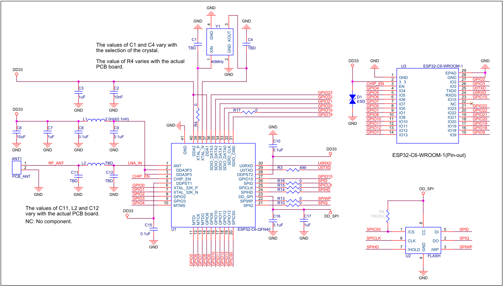

Figure 8-2. ESP32-C6-WROOM-1U Schematics

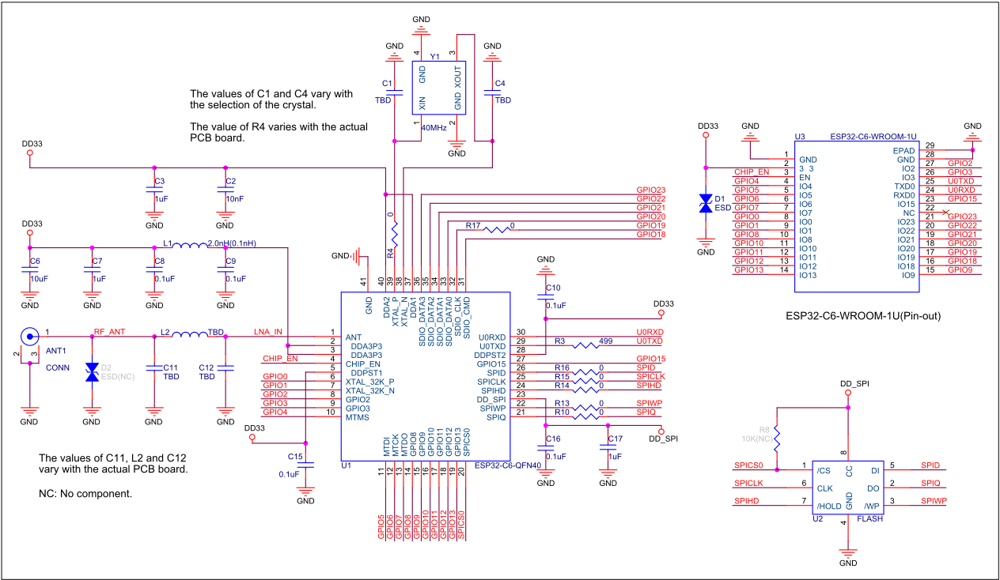

## 9 Peripheral Schematics

This is the typical application circuit of the module connected with peripheral components (for example, power supply, antenna, reset button, JTAG interface, and UART interface).

Figure 9-1. Peripheral Schematics

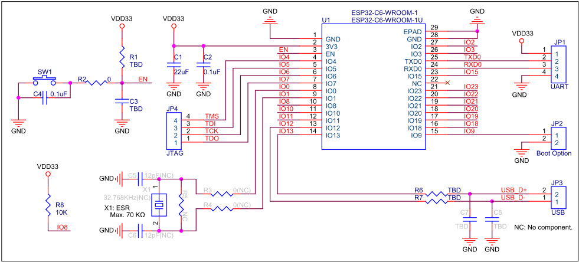

- Soldering the EPAD to the ground of the base board is not a must, however, it can optimize thermal performance. If you choose to solder it, please apply the correct amount of soldering paste. Too much soldering paste may increase the gap between the module and the baseboard. As a result, the adhesion between other pins and the baseboard may be poor.
- To ensure that the power supply to the ESP32-C6 chip is stable during power-up, it is advised to add an RC delay circuit at the EN pin. The recommended setting for the RC delay circuit is usually R = 10 k Ω and C = 1 µ F. However, specific parameters should be adjusted based on the power-up timing of the module and the power-up and reset sequence timing of the chip. For ESP32-C6's power-up and reset sequence timing diagram, please refer Section 4.5 Chip Power-up and Reset .

## 10 Physical Dimensions

## 10.1 Physical Dimensions

Figure 10-1. ESP32-C6-WROOM-1 Physical Dimensions

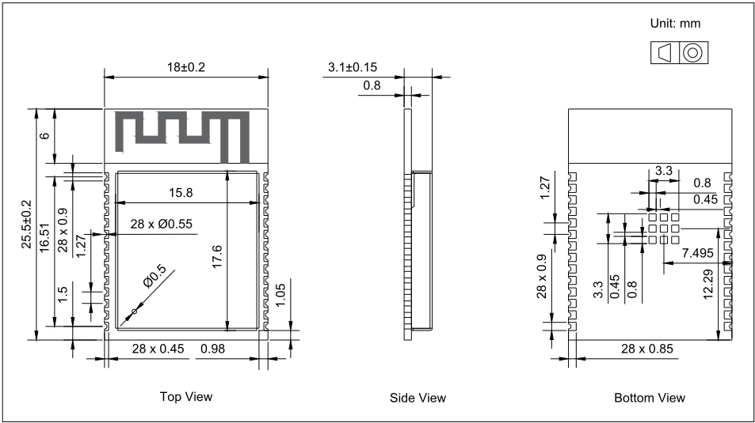

Figure 10-2. ESP32-C6-WROOM-1U Physical Dimensions

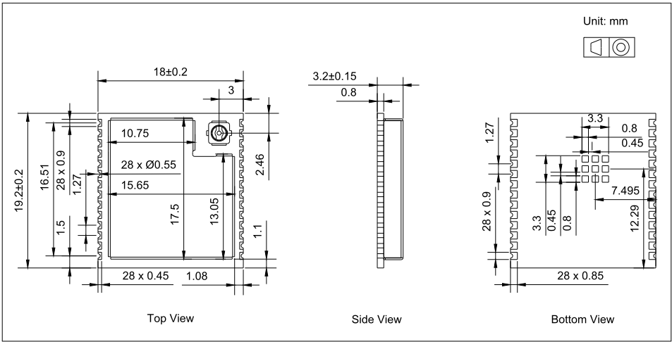

## Note:

For information about tape, reel, and product marking, please refer to ESP32-C6 Module Packaging Information .

## 10.2 Dimensions of External Antenna Connector

ESP32-C6-WROOM-1U uses the first generation external antenna connector as shown in Figure 10-3 Dimensions of External Antenna Connector . This connector is compatible with the following connectors:

- U.FL Series connector from Hirose
- MHF I connector from I-PEX
- AMC connector from Amphenol

Figure 10-3. Dimensions of External Antenna Connector

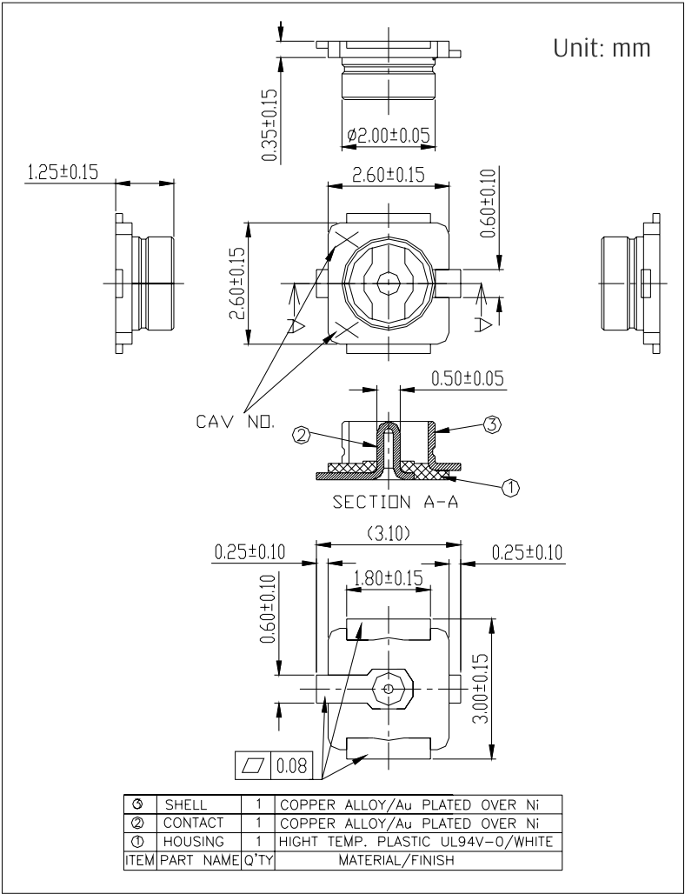

The external antenna used for ESP32-C6-WROOM-1U during certification testing is the first generation monopole antenna, with material code TFPD05H08750011.

The module does not include an external antenna upon shipment. If needed, select a suitable external antenna based on the product's usage environment and performance requirements.

It is recommended to select an antenna that meets the following requirements:

- 2.4 GHz band
- 50 Ω impedance
- The maximum gain does not exceed 2.33 dBi, the gain of the antenna used for certification
- The connector matches the specifications shown in Figure 10-3 Dimensions of External Antenna Connector

## Note:

If you use an external antenna of a different type or gain, additional testing, such as EMC, may be required beyond the existing antenna test reports for Espressif modules. Specific requirements depend on the certification type.

## 11 PCB Layout Recommendations

## 11.1 PCB Land Pattern

This section provides the following resources for your reference:

- Figures for recommended PCB land patterns with all the dimensions needed for PCB design. See Figure 11-1 ESP32-C6-WROOM-1 Recommended PCB Land Pattern and Figure 11-2 ESP32-C6-WROOM-1U Recommended PCB Land Pattern .
- Source files of recommended PCB land patterns to measure dimensions not covered in Figure 11-1 and Figure 11-2. You can view the source files for ESP32-C6-WROOM-1 and ESP32-C6-WROOM-1U with Autodesk Viewer.
- 3D models of ESP32-C6-WROOM-1 and ESP32-C6-WROOM-1U. Please make sure that you download the 3D model file in .STEP format (beware that some browsers might add .txt).

Figure 11-1. ESP32-C6-WROOM-1 Recommended PCB Land Pattern

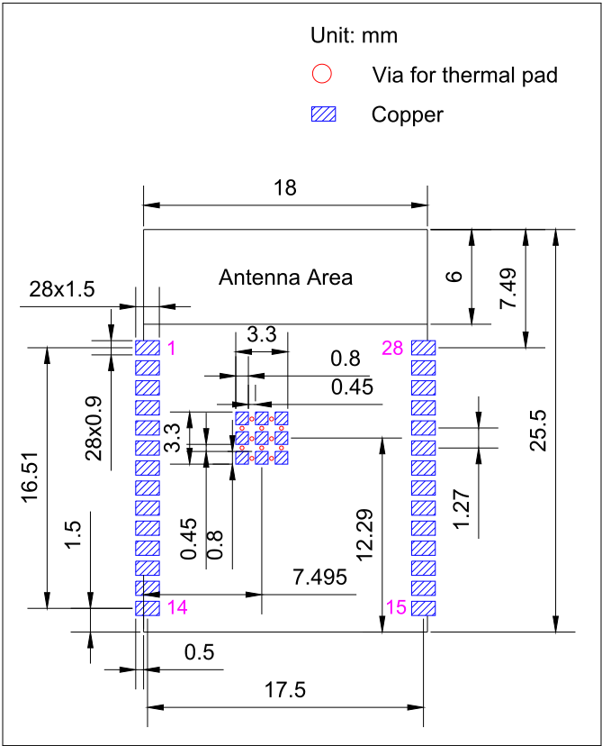

Figure 11-2. ESP32-C6-WROOM-1U Recommended PCB Land Pattern

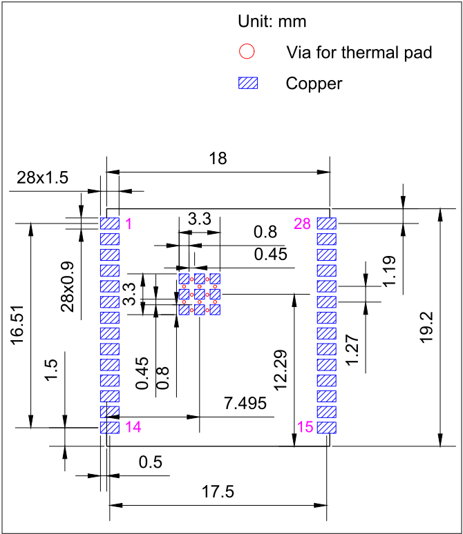

## 11.2 Module Placement for PCB Design

If module-on-board design is adopted, attention should be paid while positioning the module on the base board. The interference of the base board on the module's antenna performance should be minimized.

For details about module placement for PCB design, please refer to ESP32-C6 Hardware Design Guidelines &gt; Section Positioning a Module on a Base Board .

## 12 Product Handling

## 12.1 Storage Conditions

The products sealed in moisture barrier bags (MBB) should be stored in a non-condensing atmospheric environment of &lt; 40 °C and 90%RH. The module is rated at the moisture sensitivity level (MSL) of 3.

After unpacking, the module must be soldered within 168 hours with the factory conditions 25±5 °C and 60%RH. If the above conditions are not met, the module needs to be baked.

## 12.2 Electrostatic Discharge (ESD)

- ·
- Human body model (HBM): ±2000 V

- Charged-device model (CDM): ±500 V

## 12.3 Reflow Profile

Solder the module in a single reflow.

Figure 12-1. Reflow Profile

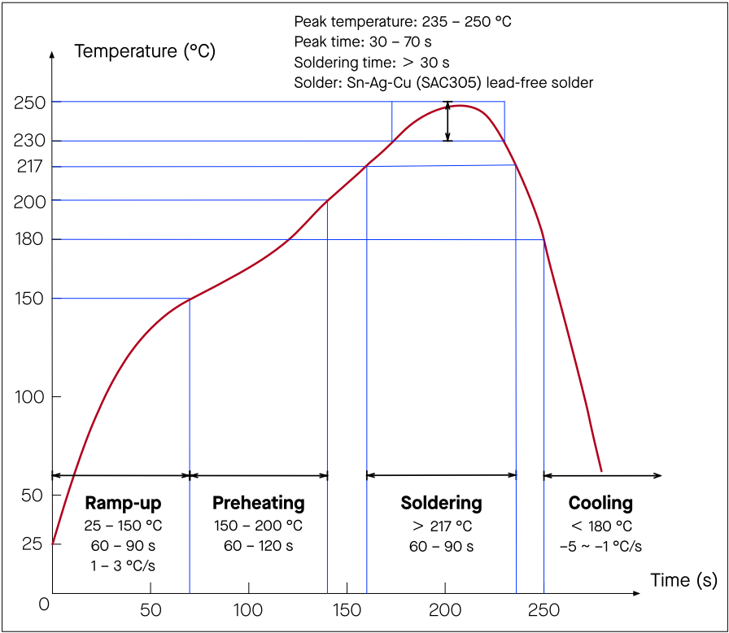

## 12.4 Ultrasonic Vibration

Avoid exposing Espressif modules to vibration from ultrasonic equipment, such as ultrasonic welders or ultrasonic cleaners. This vibration may induce resonance in the in-module crystal and lead to its malfunction or even failure. As a consequence, the module may stop working or its performance may deteriorate .

## Datasheet Versioning

| Datasheet Version            | Status              | Watermark                               | Definition                                                                                                                                                                                              |
|------------------------------|---------------------|-----------------------------------------|---------------------------------------------------------------------------------------------------------------------------------------------------------------------------------------------------------|
| v0.1 ~ v0.5 (excluding v0.5) | Draft               | Confidential                            | This datasheet is under development for products in the design stage. Specifications may change without prior notice.                                                                                   |
| v0.5 ~ v1.0 (excluding v1.0) | Preliminary release | Preliminary                             | This datasheet is actively updated for products in the verification stage. Specifications may change before mass production, and the changes will be documentation in the datasheet's Revision History. |
| v1.0 and higher              | Official release    | -                                       | This datasheet is publicly released for products in mass production. Specifications are finalized, and major changes will be communicated via Product Change Notifications (PCN).                       |
| Any version                  | -                   | Not Recommended for New Design (NRND) 1 | This datasheet is updated less frequently for products not recommended for new designs.                                                                                                                 |
| Any version                  | -                   | End of Life (EOL) 2                     | This datasheet is no longer mtained for products that have reached end of life.                                                                                                                         |

## Related Documentation and Resources

## Related Documentation

- ESP32-C6 Series Datasheet - Specifications of the ESP32-C6 hardware.
- ESP32-C6 Technical Reference Manual - Detailed information on how to use the ESP32-C6 memory and peripherals.
- ESP32-C6 Hardware Design Guidelines - Guidelines on how to integrate the ESP32-C6 into your hardware product.
- ESP32-C6 Series SoC Errata - Descriptions of known errors in ESP32-C6 series of SoCs.
- Certificates https:/ /espressif.com/en/support/documents/certificates
- ESP32-C6 Product/Process Change Notifications (PCN) https:/ /espressif.com/en/support/documents/pcns?keys=ESP32-C6
- Documentation Updates and Update Notification Subscription https:/ /espressif.com/en/support/download/documents

## Developer Zone

- ESP-IDF Programming Guide for ESP32-C6 - Extensive documentation for the ESP-IDF development framework.

·

ESP-IDF

and other development frameworks on GitHub.

[https:/ /github.com/espressif](https://github.com/espressif)

- ESP32 BBS Forum - Engineer-to-Engineer (E2E) Community for Espressif products where you can post questions, share knowledge, explore ideas, and help solve problems with fellow engineers. https:/ /esp32.com/
- ESP-FAQ - A summary document of frequently asked questions released by Espressif. https:/ /espressif.com/projects/esp-faq/en/latest/index.html
- The ESP Journal - Best Practices, Articles, and Notes from Espressif folks. https:/ /blog.espressif.com/
- See the tabs SDKs and Demos , Apps , Tools , AT Firmware . https:/ /espressif.com/en/support/download/sdks-demos

## Products

- ESP32-C6 Series SoCs - Browse through all ESP32-C6 SoCs. https:/ /espressif.com/en/products/socs?id=ESP32-C6
- ESP32-C6 Series Modules - Browse through all ESP32-C6-based modules. https:/ /espressif.com/en/products/modules?id=ESP32-C6
- ESP32-C6 Series DevKits - Browse through all ESP32-C6-based devkits. https:/ /espressif.com/en/products/devkits?id=ESP32-C6
- ESP Product Selector - Find an Espressif hardware product suitable for your needs by comparing or applying filters. https:/ /products.espressif.com/#/product-selector?language=en

## Contact Us

·

See the tabs Sales Questions

,

Technical Enquiries

(Online stores),

,

Circuit Schematic &amp; PCB Design Review

Become Our Supplier

,

Comments &amp; Suggestions

[https:/ /espressif.com/en/contact-us/sales-questions](https://espressif.com/en/contact-us/sales-questions)

.

,

Get Samples

## Revision History

| Date       | Version   | Release notes                                                                                                                                                                                                                                                                                                                                                                                                                                                                                                                                                                                                                                                                                                            |
|------------|-----------|--------------------------------------------------------------------------------------------------------------------------------------------------------------------------------------------------------------------------------------------------------------------------------------------------------------------------------------------------------------------------------------------------------------------------------------------------------------------------------------------------------------------------------------------------------------------------------------------------------------------------------------------------------------------------------------------------------------------------|
| 2025-12-10 | v1.4      | In Section 1.2 Series Comparison : • Updated 'Ordering Code' to 'Part Number' • Added information about ESP32-C6-WROOM-1-N16 and ESP32-C6- WROOM-1U-N16                                                                                                                                                                                                                                                                                                                                                                                                                                                                                                                                                                  |
| 2025-07-17 | v1.3      | • In Chapter 2 Block Diagram , added a note about pin mapping between the chip and the in-package flash • In Chapter 10.2 Dimensions of External Antenna Connector , added the external antenna information for certification • Added Sections 4.5 Chip Power-up and Reset , 6.5 Memory Specifica- tions and Datasheet Versioning                                                                                                                                                                                                                                                                                                                                                                                        |
| 2025-03-21 | v1.2      | • In Chapter 1 Module Overview , renamed Section 1.2 Description to 1.2 Series Comparison , and added a table note about the maximum clock frequency supported by SPI flash • In Table 6-1 Absolute Maximum Ratings of Section 6 Electrical Character- istics , updated the maximum storage temperature from 85°C to 105°C • Improved the structure, formatting, and wording in: - Chapter 4 Boot Configurations (used to be Section 3.3 Strapping Pins ) - Chapter 5 Peripherals (used to be Chapter 4 Peripherals ) - Chapter 10 Physical Dimensions and Chapter 11 PCB Layout Recom- mendations (used to be Chapter 9 Physical Dimensions and PCB Land Pattern ) • Added Section 11.2 Module Placement for PCB Design |
| 2024-01-19 | v1.1      | • In Section 1.1 Features , added information about certification and test • In Section 1.2 Series Comparison , the minimum RF transmit power for Bluetooth LE and 802.15.4 in active mode was updated from -24 dBm to -16 dBm, and the maximum power was updated from 20 dBm to 19 dBm • In Chapter 7 RF Characteristics , the RF transmit power range for Bluetooth LE and 802.15.4 was updated from -24 ~ 20 dBm to -16 ~ 19 dBm • In Section 11 PCB Layout Recommendations , added information about the recommended PCB land pattern of ESP32-C6-WROOM-1U module, and 3Dmodels of ESP32-C6-WROOM-1 and ESP32-C6-WROOM-1U mod- ules                                                                                  |

Cont'd on next page

## Cont'd from previous page

| Date       | Version   | Release notes                                                               |
|------------|-----------|-----------------------------------------------------------------------------|
| 2023-07-04 | v1.0      | • Updated the vector picture of ESP32-C6-WROOM-1U on the titlepage to       |
| 2023-07-04 | v1.0      | remove the castellated pins at the bottom                                   |
| 2023-07-04 | v1.0      | • In Section 1.2 Series Comparison , removed peripheral-related information |
| 2023-07-04 | v1.0      | and information on ESP32-C6-WROOM-1-H4, ESP32-C6-WROOM-1-N16,               |
| 2023-07-04 | v1.0      | ESP32-C6-WROOM-1U-H4, and ESP32-C6-WROOM-1U-N16, and added                  |
| 2023-07-04 | v1.0      | a note about module customization                                           |
| 2023-07-04 | v1.0      | • Added Chapter 5 Peripherals                                               |
| 2023-07-04 | v1.0      | • Updated Figure 10-1 ESP32-C6-WROOM-1 Physical Dimensions and Fig-         |
| 2023-07-04 | v1.0      | ure 10-2 ESP32-C6-WROOM-1U Physical Dimensions to change the tol-           |
| 2023-07-04 | v1.0      | erance in the top view from 0.25 to 0.2                                     |
| 2023-07-04 | v1.0      |                                                                             |
| 2023-04-17 | v0.6      | Added information about ESP32-C6-WROOM-1U module                            |
| 2023-02-16 | v0.5      | Preliminary release                                                         |

## Disclaimer and Copyright Notice

Information in this document, including URL references, is subject to change without notice.

ALL THIRD PARTY'S INFORMATION IN THIS DOCUMENT IS PROVIDED AS IS WITH NO WARRANTIES TO ITS AUTHENTICITY AND ACCURACY.

NO WARRANTY IS PROVIDED TO THIS DOCUMENT FOR ITS MERCHANTABILITY, NON-INFRINGEMENT, FITNESS FOR ANY PARTICULAR PURPOSE, NOR DOES ANY WARRANTY OTHERWISE ARISING OUT OF ANY PROPOSAL, SPECIFICATION OR SAMPLE.

All liability , including liability for infringement of any proprietary rights, relating to use of information in this document is disclaimed. No licenses express or implied, by estoppel or otherwise, to any intellectual property rights are granted herein.

The Wi-Fi Alliance Member logo is a trademark of the Wi-Fi Alliance. The Bluetooth logo is a registered trademark of Bluetooth SIG.

All trade names, trademarks and registered trademarks mentioned in this document are property of their respective owners, and are hereby acknowledged.

Copyright © 2025 Espressif Systems (Shanghai) Co., Ltd. All rights reserved.

[www.espressif.com](https://www.espressif.com/)